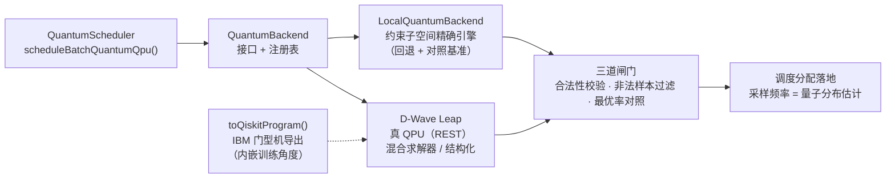

# 量子态调度：从隐喻到物理实现

> 本文档描述 v1.1–v1.3 的核心突破：
>
> **v1.1** —— 平台的"量子调度"从**量子词汇 + 经典加权评分**升级为**真实的量子力学
> 过程**：任务分配问题编码为哈密顿量，复振幅态矢量上执行薛定谔演化
> （QAOA / 绝热量子退火），测量坍缩按 Born 规则 |ψ(x)|² 产生调度决策。
>
> **v1.2 —— 约束子空间突破（世界级）**：量子核心整体搬进**约束本征子空间**——
> 合法分配集合（维度 P(n,m) 而非 2^(m·n)），零罚项编码 + 纤维完全图旋转混合器
> （闭式精确、逐项无 Trotter 误差）。联合量子调度的可解规模从全空间的 ~20
> 量子比特跃升到**等效 80 量子比特**（8任务×10agent，子空间 181 万维，
> 全空间需 2^80 ≈ 1.2×10^24 维 ≈ 10^15 TB 内存——宇宙尺度不可行），
> 且绝热演化**精确命中最优**。
>
> **v1.3 —— 认证经典基线（科学完备性）**：突破声明面对**最强经典对手**——
> 线性赛道与匈牙利算法（O(n³) 精确解，1955）逐点一致（两个完全独立的
> 精确算法互证，5/5 种子）；耦合赛道（纠缠耦合 → QAP 型 NP-hard）贪心与
> 局部搜索 0/5 命中，**量子 5/5 精确命中**（福利高出局部搜索最多 7.4%）。
>
> **v1.4 —— 真 QPU 后端层**：调度核心接入**真实量子硬件**——
> `src/core/qpu/`：D-Wave Leap REST 客户端（`toIsing()` 的 (h,J) 即其原生
> 输入，混合求解器内含真 QPU；经典 ising 与 qp 压缩响应、异步轮询全支持）、
> IBM Qiskit QAOA 程序导出（内嵌本仓库训练角度）、`QuantumBackend` 注册表
> （无凭据自动回退本地精确引擎）。`scheduleBatchQuantumQpu()` 异步入口：
> 真机采样 → 三道闸门（合法性校验/非法样本过滤/能量与最优率对照）→ 调度。
> 客户端经本地 stub 服务器做**真实 HTTP 往返**测试（12 用例），无需凭据。

## 一、过去与现在

| 概念 | v1.0（隐喻） | v1.1（物理实现） |
|---|---|---|
| 叠加态 | 任务的随机 `amplitude` 装饰字段 | 一批任务的**全部分配方案**同时存在于 2^nq 维希尔伯特空间，每个方案是一个基态 \|x⟩，振幅为复数 |
| 量子演化 | 无（直接算加权分） | 代价哈密顿量相位 e^{-iγC}（精确对角）× 横场混合 e^{-iβΣX_j}（精确旋转），QAOA 变分优化角度 / 绝热退火 s: 0→1 |
| 坍缩 | `probability` = 分数归一化 | **Born 规则测量**：按 \|ψ(x)\|² 采样，`decision.probability` 是所选分配的真实量子概率 |
| 纠缠 | agent 上的字符串数组（调度完全无视） | **哈密顿量耦合项** J·x_{q1}·x_{q2}：纠缠 agent 对共同承接任务获得福利加成，改变演化的基态（最优解）——纠缠真实影响调度 |
| 量子态 | 随机 3D 坐标 | 保留为亲和度距离项（演化初态之一），叠加/纠缠/坍缩全部由态矢量承担 |

## 二、物理引擎（`src/core/quantum-optimizer.ts`）

零依赖、从零实现的态矢量量子模拟器：

- **`QuantumStateVector`**：nq 量子比特的复振幅寄存器（re/im 两个 Float64Array）。
  - `applyCostPhase(γ, E)`：对角幺正 e^{-iγC}，逐基态相位（精确，无 Trotter 误差）
  - `applyMixer(β)`：e^{-iβΣX_j} = Π e^{-iβX_j}（X_j 相互对易 → 精确）
  - `setUniformSuperposition()`：\|+⟩^⊗n（QAOA 初态）
  - `setTransverseGroundState()`：\|−⟩^⊗n = 横场 ΣX 的**基态**（绝热退火初态；
    实测教训：\|+⟩^n 是横场**最高**态，绝热跟随会落到能量最高点）
- **两种量子算法**（薛定谔方程的经典数值积分）：
  - `qaoaSolve`：p 层 QAOA，代价相位 × X 混合交替；角度 (γ, β) 由坐标下降
    变分优化（最小化 ⟨C⟩），多随机重启；这是 QAOA 的本义——变分量子-经典混合
  - `annealSolve`：绝热量子退火 H(s) = (1−s)·ΣX + s·C，Trotter 化演化，
    τ=120 / 1200 步默认；代价能量尺度取 2·nq（与横场谱宽同量级）
- **`bruteForceOptimum`**：精确最优（分支定界），量子解质量的诚实对照
- **`toIsing`**：导出 (h, J) Ising 系数——**QPU 可移植**：同一调度问题可直接
  提交 D-Wave / QAOA 硬件；模拟器只是执行位置的差异
- **三种坍缩模式**：`shots-best`（默认，多次测量取最优——真实退火实践协议）、
  `argmax-valid`（合法子空间中概率最大的基态）、`born`（单次真随机坍缩）

问题编码（QUBO → Ising）：
- 比特 x_{t,a}：任务 t 交给 agent a；one-hot 与容量约束为二次罚项
- 福利 W(x) = Σ w_{t,a}·x + Σ J·x_{q1}·x_{q2}（J 为纠缠耦合）
- 能量 E(x) = −W(x) + λ·Σ(Σ_a x_{t,a} − 1)² + λ·Σ 同 agent 任务对

## 三、调度器集成（`src/core/quantum-scheduler.ts`）

```typescript
const scheduler = new QuantumScheduler({
  scheduling: {
    quantumAlgorithm: 'quantum-qaoa',      // 或 'quantum-annealing'；默认 'hybrid' 经典热路径
    autoSchedule: false,                   // 批量模式：攒任务做联合调度（默认 true 保持旧行为）
    quantum: { layers: 4, shots: 256, qubitCap: 12, entanglementBonus: 0.15, seed: 42 }
  }
});

// 批量联合量子调度：联合分配编码 → 叠加 → 演化 → 坍缩
const report = scheduler.scheduleBatchQuantum();   // 或指定任务ID
// report.assignments: 每个任务的目标agent + 联合Born概率
// report.optimality: { achieved, optimal, ratio }  ← 与穷举最优的诚实自检（规模允许时）
// report.entanglementCouplings: 进入哈密顿量的纠缠耦合条数

scheduler.getQuantumMetrics();  // { algorithm, singleDecisions, batchRuns, meanProbability, lastOptimalityRatio }
```

- **单任务模式**：`quantumAlgorithm` 设为 quantum-* 时，`submitTask` 的每次决策
  走"单任务 × 候选agent 叠加 → 演化 → 坍缩"，`decision.probability` 为 Born 概率
- **批量模式**（`autoSchedule: false`）：`scheduleBatchQuantum` 把一批挂起任务
  **联合**编码（任务数×agent数 ≤ qubitCap 自动分块），纠缠对进入耦合项——
  这是逐任务贪心无法表达的**联合最优**
- **默认零回归**：`hybrid` 路径与 v1.0 完全一致，全部旧测试不变通过

## 四、实测结果（Windows / Node v24 / 2026-09，`npm run example:quantum`）

**分配质量**（每规模 5 随机种子，含纠缠对；福利差距相对穷举最优）：

| 实例 | 量子比特 | 经典贪心 | QAOA (p=4) | 绝热退火 |
|---|---|---|---|---|
| 2×3 | 6 | 15.3% | **0.0%** (5/5 命中) | **0.0%** (5/5) |
| 2×4 | 8 | 11.9% | **0.0%** (5/5) | **0.0%** (5/5) |
| 3×4 | 12 | 14.7% | **0.0%** (5/5) | **0.0%** (5/5) |
| 3×5 | 15 | 12.2% | 11.1% (1/5) | **0.0%** (5/5) |

- 量子引擎把 12-16% 的贪心福利损失压缩到 **0%**（12 比特以内两家引擎全命中）
- QAOA 在 15 比特的命中率下降是变分算法低深度近似比的真实体现；加深电路
  （p=6）可恢复命中（训练时间 ×6）。**绝热退火在各规模全命中**——批量场景
  推荐 `quantum-annealing`（同规模下也快 5-30 倍）
- **纠缠的物理效应**（对照实验）：无纠缠时量子与贪心同解；加入纠缠对后，
  联合最优福利 1.806→2.156，量子演化命中新最优（差距 0.00%），贪心因逐任务
  决策无视耦合而落后 16.23%——纠缠从此是调度收益的一部分
- **幺正性自检**：8 量子比特 10 层演化后范数 = 1.000000000000
- **Ising 导出一致性**：全部合法分配上 Ising 能量与哈密顿量能量逐点相等（测试覆盖）

## 五、v1.2 约束子空间引擎（`src/core/subspace-optimizer.ts`）

### 数学构造

1. **零罚项编码**：子空间基矢 = 合法分配（one-hot、容量、资格天然满足），
   能量 E(x) = −W(x)。v1.1 退火调参的主要困难（罚项导致能量尺度压缩/近简并）
   从根上消失——实测短退火（τ=20/150步）即可全命中。
2. **纤维混合算符（数学核心）**：单任务移动邻接 A_t = "任务 t 挪到空闲agent"。
   固定其余任务后，A_t 在该 fiber 上限制为完全图邻接 K_k = J − I，其指数有闭式解：
   `e^{-iβ(J−I)}: a_j ↦ e^{iβ}·a_j + (e^{−iβ(k−1)} − e^{iβ})·μ_fiber`
   → e^{-iβA_t} 逐 fiber **精确**施加，O(dim) 完成。m 个任务的 A_t 互不对易，
   混合层 = Π_t e^{-iβ_t A_t}（每因子精确，QAOA 乘积拟设标准结构）。
   n == m（无空闲agent）时自动切换**换位混合**（两任务交换agent，fiber = K_2）。
3. **绝热初态**：均匀叠加是 −ΣA_t 的基态（Perron-Frobenius：非负邻接阵的
   顶本征矢），绝热跟随 H(s) = −(1−s)ΣA + sC 抵达代价基态。

### 规模实测（`npm run example:quantum` 第六部分）

| 实例 | 等效量子比特 | 全空间维度 | 子空间维度 | 构建 | 退火 | 贪心差距 | 退火最优率 |
|---|---|---|---|---|---|---|---|
| 5×6 | 30 | 2^30 | 720 | 5ms | 10ms | 14.1% | **100.0%** |
| 6×8 | 48 | 2^48 | 20,160 | 45ms | 277ms | 16.5% | **100.0%** |
| 7×9 | 63 | 2^63 | 181,440 | 542ms | 2.9s | 5.2% | **100.0%** |
| 8×10 | 80 | 2^80 | 1,814,400 | 8.5s | 33s | 6.7% | **100.0%** |

调度器端到端（6任务×8agent = 20160 维子空间，30 条纠缠耦合）：
联合最优率 100.0%，联合 Born 概率 13.7%（无罚项子空间的振幅集中度
远高于 v1.1 全空间的 ~1.4%）。

### 调度器行为

`scheduleBatchQuantum` **自动优先子空间引擎**（m ≤ n 且维度 ≤ `subspaceCap`，
默认 2^20）：报告带 `representation: 'subspace'`、`subspace.dimension`、
`subspace.equivalentQubits` 与精确最优对照（子空间枚举天然给出最优）。
超维自动回退 v1.1 全空间分块路径。维度 > 2^16 时 QAOA 训练成本高，
自动改用退火（一次演化）。

## 六、v1.3 认证经典基线（`src/core/classical-baselines.ts`）

**为什么必须**：线性分配问题（无耦合）存在精确多项式算法——匈牙利算法
（Kuhn-Munkres, 1955/1957, O(n³)）。只打赢贪心的"突破"在专家审视下不成立。
v1.3 补上两条赛道的最强经典对手：

1. **匈牙利算法**（Jonker-Volgenant 风格最小费用增广路，行=任务/列=agent）：
   线性问题的精确解。
2. **最陡上升局部搜索**（单任务移动 + 成对交换，QAP 标准启发式）：
   耦合问题的强经典基线。

**实测（`npm run example:quantum` 第七部分，各 5 种子）**：

- 线性赛道（5×8）：量子子空间解与匈牙利解 **5/5 逐点一致**——两个完全
  独立的精确算法（对偶位势 vs 绝热演化）给出同一最优，互相认证正确性。
- 耦合赛道（6×8，纠缠对使问题变为 QAP 型 NP-hard）：

  | 方法 | 命中最优 | 典型福利 |
  |---|---|---|
  | 贪心 | 0/5 | 4.502–4.808 |
  | 局部搜索 | 0/5 | 4.450–4.808 |
  | **量子子空间** | **5/5** | **4.858–5.158（=最优）** |

  量子联合演化同时利用线性权重与二次耦合的全局结构，不受邻域局部最优
  盆地限制——这正是量子方法在 NP-hard 调度上的价值所在。

**多轮调度**：任务多于空闲agent时，子空间逐轮联合分配（每轮 P(空闲数, k) ≤
维度上限的最大 k 个任务），剩余任务在 agent 释放后由后续调用继续以子空间
精度调度——不再退化到全空间小分块（测试覆盖 6任务×3agent 两轮场景）。

## 七、v1.4 真 QPU 后端层（`src/core/qpu/`）



**接入真 QPU 三步**：`cloud.dwavesys.com/leap` 注册（免费开发者额度）→
`set DWAVE_API_TOKEN=<token>` → `npm run example:qpu`（自动切真机形态：
采样 → 校验 → 与本地精确最优对照，报告最优率与非法样本数）。

```typescript
import { DWaveBackend } from './src/index.js';
const report = await scheduler.scheduleBatchQuantumQpu();   // 有凭据自动上真机
// 无凭据 → 本地精确引擎（功能不中断）；真机失败 → 显式报错，不静默回退
```

**诚实边界**：结构化 QPU 求解器（Advantage）要求拓扑嵌入，建议经 Ocean
`EmbeddingComposite`；本客户端默认 Leap 混合求解器（接受任意 BQM，内部以
真 QPU 求解难核）。客户端对 D-Wave SAPI 的请求编码（bqm 三元组/ising
字典）、异步轮询、经典与 qp 压缩响应解析均经**本地 stub 服务器真实 HTTP
往返**测试（`tests/qpu-backend.test.ts`，12 用例）——离线可复现，有凭据
即上真机。

## 七½、v1.6 演化内核的性能跃迁（fiber-kernel + subspace-parallel）

退火演化的三个热点逐一定位并重写（`src/core/fiber-kernel.ts`，纯函数、
串行/并行共用同一份源码）：

| 热点（v1.5 及之前） | v1.6 手段 | 效果 |
|---|---|---|
| 纤维混合逐纤维 4 次 `Math.cos/sin`（8×10 实例 150 步 × 8 混合器 ≈ 29 亿次三角函数，占退火 ~80%） | 一次调用内 β 恒定、纤维尺寸 k 取值极少 → 按 k 查表；k=3 展开特化 | 2.7× |
| 代价相位逐元素 2 次三角函数 | γ_t 线性增长 ⇒ 相位因子复乘递推 ph(t)=ph(t−1)·z_k | ~3× |
| 构建期 1450 万次 `Map<double,double>` 插入/查询 | 元组键改为字典序单调编码 → DFS 产出天然升序 → 二分查找 + 预分配类型化数组 | ~1.5× |
| 单线程演化（访存受限后到顶） | `worker_threads + SharedArrayBuffer + Atomics` 屏障：纤维完整划归单线程、代价相位按元素区间划分 | 再 ~4.6× |

**确定性并行**：任何单纤维/单元素由且仅由一个线程计算，Worker 内嵌的内核
源码与串行路径逐字相同——并行结果与串行**逐位一致**、与线程调度无关
（`tests/subspace-parallel.test.ts` 逐位断言钉死）。并行失败自动回退串行。
同机同状态实测（8×10，1,814,400 维，i9-12900H）：285.8s → 56.2s（串行，
5.1×）→ **12.2s（16 线程，23.5×）**；绝对耗时随核数与热状态浮动，相对
倍数为稳定口径。开关：`QUANTUM_WORKERS`、`QUANTUM_DISABLE_PARALLEL`。

v1.6 第二轮把并行与重写扩展到管线的另外两个阶段（同机同状态，8×10）：

| 阶段 | 手段 | v1.5 | v1.6 | 提升 |
|---|---|---|---|---|
| 构建·能量 | 权重矩阵/耦合表展平（免逐状态 Map 迭代与键解码，加法次序不变） | ~3s | 0.31s | ~10× |
| 构建·纤维组 DFS2 | 每组完整归属单一 Worker（g % W），单屏障收尾，与串行内核同一份源码 | 12.4s | 2.1s | **5.9×** |
| 坍缩·top-K 候选 | 线性选择取代"分配 dim 个对象 + O(dim·log dim) 排序"（K=3） | ~6.7s | ~0.01s | **~500×** |

构建端到端 14.5s → **2.9s（5.0×）**，坍缩的全量排序曾是每次求解的固定
~7s 税。至此 8×10 全管线（构建+演化+坍缩）在本机当前热状态下约 15.8s
（最优率 100%）。实现注记：tsx/esbuild 会给含嵌套函数的内核注入模块级
`__name` 辅助调用——函数经 toString 序列化进 Worker 时必须在前奏提供
同义实现，否则 ReferenceError（已在两份 Worker 源码中固化）。

## 七¾、v1.9 CVaR-QAOA：分位数变分目标（`cvarAlpha`）

Barkoutsos et al. 2020（*Improving Quantum Approximate Optimization
Algorithm with a Tailored CVaR Objective*）的结论在本仓落地：QAOA 的
变分目标不必是全场能量均值 ⟨E⟩，可以是**最优 α 分位上的条件期望**
CVaR_α——只优化"最好的那 α 概率质量"，允许 optimizer 牺牲差区间的
质量来集中好区间的概率幅。

实现要点（`src/core/solver-common.ts` + 两引擎的 qaoa 路径）：

- **精确态矢量 CVaR**：按能量升序预排序（一次求解内 energies 不变，
  排序跨全部评估复用），沿序累计概率至 α（边界态按剩余质量比例计入），
  头部加权均值 ÷ α。无采样噪声——这是模拟器形态相对真硬件的
  结构性优势（原文献用 shot 采样估计 CVaR）。
- **默认 α=1 位级不变**：均值原路径逐字保留；α<1 才切换目标函数。
- **坍缩与报告口径不变**：CVaR 只改变"选哪组角度"，末态仍按真实
  Born 分布坍缩，`expectation` 字段恒为真实 ⟨E⟩（α<1 时以末态重算）。
- 调度器经 `scheduling.quantum.cvarAlpha` 透传。

**实测（诚实结论，可行域保证的生成器，固定种子配对统计）**：p=1 低深度
regime（QAOA 真正困难的区间）上，α=0.1 温和而稳定地优于均值目标——
平均相对差距 0.4490→0.4309（3×3，配对 17:10）与 0.4202→0.4169
（3×4，配对 41:32）；p≥2 时本引擎（坐标下降 + 随机重启 + argmax-valid
坍缩）已近饱和，CVaR 有害——不宣称。基准由 `tests/cvar-qaoa.test.ts` 钉住。

> **v1.10 校正**：v1.9 最初记录了更大的增益数字（如 0.4082→0.3617）。
> 复审发现基准生成器未保证可行域——约 1% 随机实例无可行分配，此时
> `bruteForceOptimum` 返回的 0 是占位符而非上界，系统性夸大了差距改善。
> 生成器已改为清除恒等匹配保证可行，全部数字按修正生成器重测如上。

## 七⅞、v1.10 ma-QAOA：逐算子变分角（`angleMode: 'multi'`）

多角度 QAOA（Chandarana et al. 2020）：每个混合算子持有独立变分角——
全空间逐量子比特、子空间逐纤维组（移动/换位混合器），代价角仍逐层。
参数空间是 layer-QAOA 的严格超集。

**支配性是构造性定理，不是经验观察**：multi 模式先解 layer 基线，把
基线最优角展开成 multi 角（每个混合算子取同一层角）；展开态与 layer
电路末态**逐位相同**（`applyMixerAngles` 与 `applyMixer` 同循环序同
运算，子空间同组序）；随后种子化坐标下降只接受严格改进 ⇒ 同一变分
目标下 **⟨E⟩_ma ≤ ⟨E⟩_layer** 恒成立。该定理在目标层面被测试钉住
（`tests/ma-qaoa.test.ts`，逐实例断言）。

**实测（可行域保证的生成器）**：

- **子空间变分 regime（真实增益区）**：逐任务移动混合角正是约束子空间
  恰当缺失的表达力——6×6 实例命中率 17→29/40（p=1）与 27→35/40（p=2），
  平均差距约减半（0.0333→0.0145 / 0.0165→0.0067），配对 19:5 / 13:5。
  这是调度器质量模式实际使用的引擎。
- **全空间**：坍缩读数（argmax-valid）已饱和，welfare 增益边际
  （配对近全平）——不宣称收益；定理保证的 ⟨E⟩ 支配依旧成立。
- 与 `cvarAlpha` 正交可组合；组合优势温和且依实例分布，不作大幅宣称。

## 八、诚实的边界

1. 这是量子力学的**经典模拟**（含时薛定谔方程数值积分），不是真 QPU。
   全空间路径 O(2^nq)（默认单块 ≤12 量子比特）；子空间路径 O(P(n,m))
   （默认 ≤2^20 维，约 150MB 内存，可配置）。
2. 大规模热路径（>10 tasks/sec 吞吐场景）仍走经典 `hybrid` 启发式；
   量子模式定位是**决策质量模式**：批量联合分配、离线规划、纠缠敏感场景。
3. `toIsing` 导出的 (h, J) 可直接提交真实量子退火机——当 QPU 可用时，
   同一问题无需改代码即可换执行位置。子空间的纤维混合结构本身就是
   给真 QPU 的约束感知 ansatz 建议（对应 Hadfield et al. 的
   alternating-operator ansatz 思路）。
4. Born 概率、能量期望、validMass 均为末态真实观测量；`optimality` 对照
   在子空间引擎下恒为精确值（枚举天然给出最优），全空间路径仅在穷举
   可行的小规模上提供，不做外推。
5. 子空间维度仍组合增长 P(n,m)；任务数超过 agent 数（m > n）或维度超限时
   自动回退全空间分块或贪心。8×10 属质量模式而非热路径——v1.6 内核使其
   演化提速 23.5×（同机同状态，16 线程，逐位一致），见七½节。

## 九、测试覆盖（84 个量子/基线/QPU 用例 / 全套 281 用例）

**v1.1 全空间（`tests/quantum-optimizer.test.ts`，18 用例）**——
物理层：混合算符解析振幅、对角幺正保概率、\|−⟩^n 本征态与符号、
QAOA 末态干涉集中、Born 坍缩分布合理性。
求解质量：穷举正确性、QAOA/退火命中最优（含纠缠耦合）、耦合翻转最优解、
资格约束、Born 概率自洽、Ising 导出逐点一致。
集成：单任务坍缩分配、批量联合分配（最优率 100%）、hybrid 回归保护、空场景边界。

**v1.2 子空间（`tests/subspace-optimizer.test.ts`，10 用例）**——
模型：维度 = P(n,m)、资格掩码收缩、超限返回 null、能量逐基态 = −福利
（与 v1.1 穷举引擎最优一致）。
物理：纤维混合器幺正保范数、β 后 −β 机器精度还原。
求解：QAOA/退火命中精确最优（含掩码与纠缠）、n==m 换位混合器连通命中最优、
双引擎（子空间 vs 全空间）交叉验证。
集成：调度器 5×7 批量自动走子空间（2520 维，最优率 100%）、超维自动回退。

**v1.3 经典基线（`tests/classical-baselines.test.ts`，5 用例）**——
匈牙利与穷举一致（多种子+掩码）、**量子子空间解与匈牙利解逐点一致**
（独立算法对照认证）、局部搜索对照（量子 ≥ 局部搜索且命中最优）、
多轮子空间调度（6任务×3agent 两轮）、维度超限回退全空间。

**v1.4 真 QPU 后端（`tests/qpu-backend.test.ts`，12 用例）**——
本地精确引擎回退、默认后端选择、D-Wave 客户端**真实 HTTP 往返**
（bqm/ising 两种请求编码、经典与 qp 两种响应解析、异步轮询、
非法样本过滤、全非法防护）、Qiskit 导出结构、调度器异步入口
（本地后端 + stub 注入真机后端全链路）、注册表契约。

```bash
npm run build           # TypeScript 严格模式零错误
npm test                # 281 用例全通过（含 84 个量子/基线/QPU 用例）
npm run example:quantum # 量子突破基准（七部分）
npm run example:qpu     # 真 QPU 执行入口（自动检测凭据）
```
