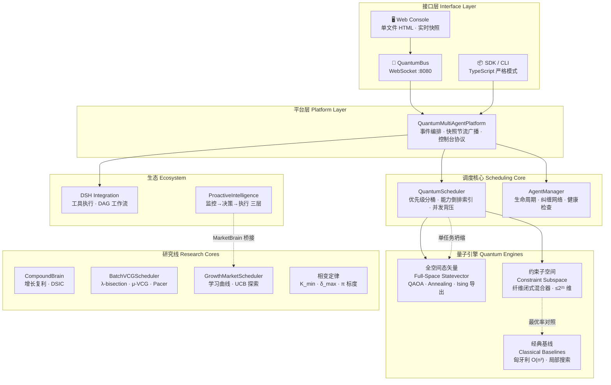
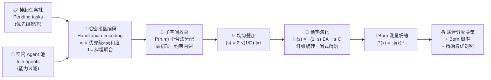
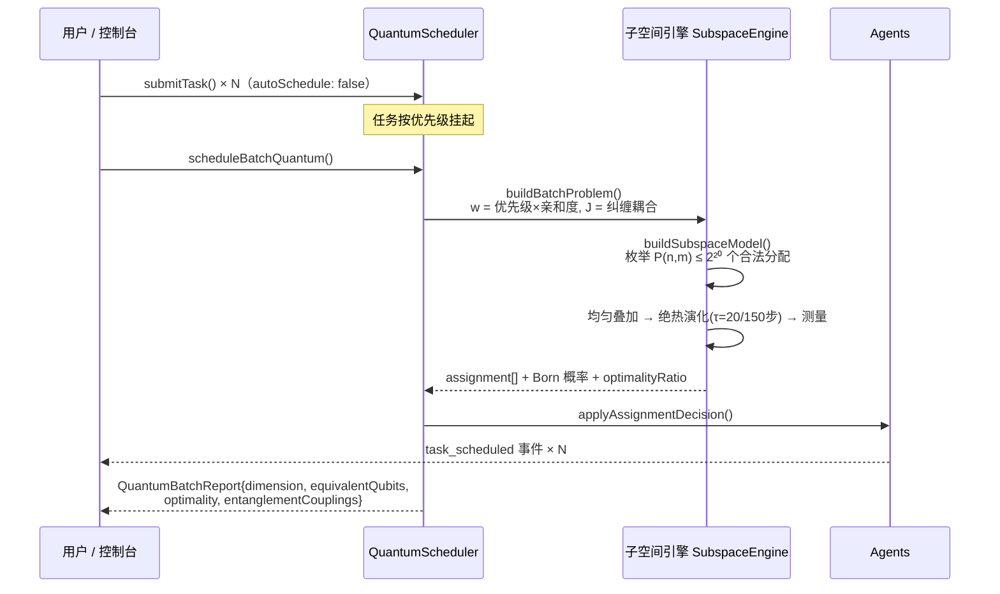
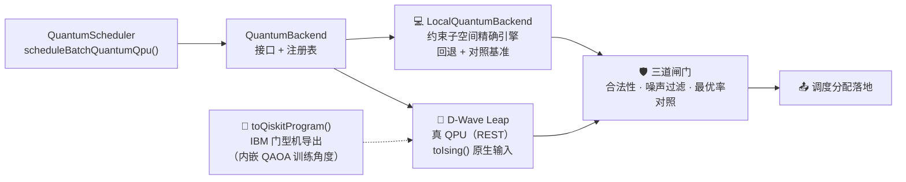
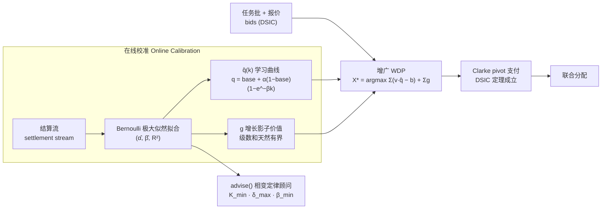
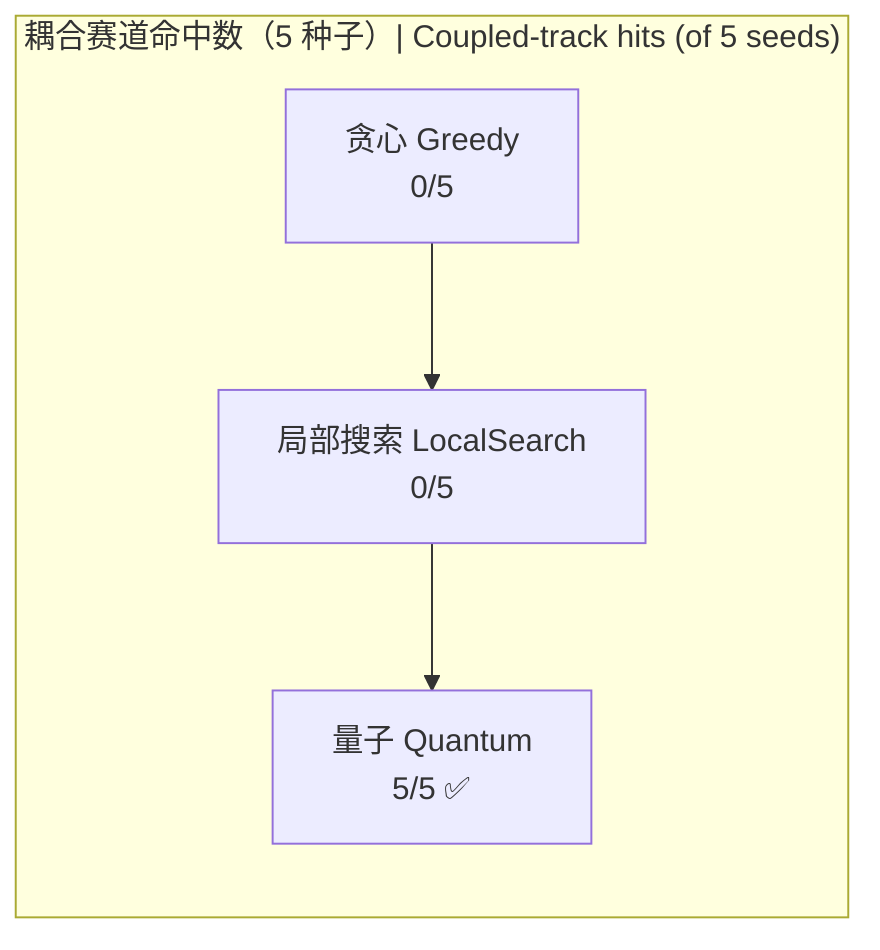
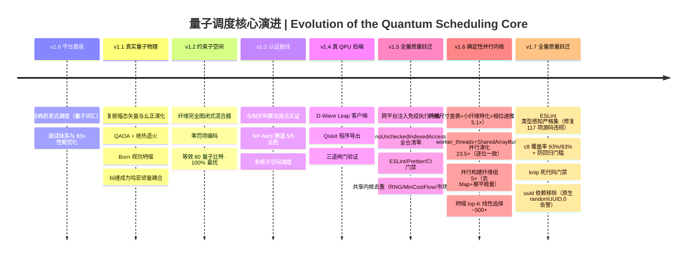

# ⚛️ 量子多Agent开发调度平台

# Quantum Multi-Agent Development & Scheduling Platform


**中文**｜一个把**真实量子算法**（QAOA / 绝热量子退火 / Born 测量坍缩）作为调度决策引擎的多Agent平台：任务分配被编码为哈密顿量，在约束子空间上精确演化——联合调度规模达**等效 80 量子比特**（全空间模拟需 10¹⁵ TB 内存，宇宙尺度不可行），且在 NP-hard 耦合赛道上 **5/5 精确命中最优**（最强经典启发式 0/5）。

> 🇬🇧 **English** | A multi-agent platform whose scheduling core runs **real quantum algorithms** (QAOA / adiabatic annealing / Born-rule measurement collapse). Task assignments are encoded as Hamiltonians and evolved **exactly** inside the constraint subspace — jointly scheduling batches up to the **equivalent of 80 qubits** (full-space simulation would need ~10¹⁵ TB of memory), and hitting the exact optimum **5/5** on NP-hard coupled instances where the strongest classical heuristics hit **0/5**.

---

## 📑 目录 | Table of Contents

| 中文 | English |
|---|---|
| [✨ 核心能力](#-核心能力--highlights) | Highlights |
| [🏗️ 架构总览](#️-架构总览--architecture) | Architecture |
| [⚛️ 量子调度核心](#️-量子调度核心--quantum-scheduling-core) | Quantum Scheduling Core |
| [🧠 市场机制研究线](#-市场机制研究线--market-mechanism-line) | Market Mechanism Line |
| [📊 基准与性能](#-基准与性能--benchmarks--performance) | Benchmarks & Performance |
| [🚀 快速开始](#-快速开始--quick-start) | Quick Start |
| [🧪 测试与质量](#-测试与质量--tests--quality) | Tests & Quality |
| [📁 目录结构](#-目录结构--repository-structure) | Repository Structure |
| [🗓️ 版本演进](#️-版本演进--version-timeline) | Version Timeline |
| [⚠️ 诚实的边界](#️-诚实的边界--honest-boundaries) | Honest Boundaries |

---

## ✨ 核心能力 | Highlights

| | 能力 | Capability |
|---|---|---|
| ⚛️ | **真实量子物理引擎**：复振幅态矢量、幺正演化（范数恒为 1.000000000000）、QAOA 变分电路、绝热退火、Born 规则测量坍缩 | **Real quantum physics**: complex-amplitude statevectors, unitary evolution, variational QAOA, adiabatic annealing, Born-rule collapse |
| 🌌 | **约束子空间突破**：在合法分配集合（维度 P(n,m)）上精确演化，零罚项、纤维混合器闭式解，等效 80 量子比特 | **Constraint-subspace breakthrough**: exact evolution over valid assignments (dim P(n,m)), penalty-free, closed-form fiber mixers, 80 equivalent qubits |
| 🔗 | **纠缠 = 物理耦合**：agent 纠缠对进入哈密顿量耦合项，实测可翻转联合最优解 | **Entanglement = physical coupling**: entangled agent pairs enter the Hamiltonian and demonstrably flip the joint optimum |
| 🏆 | **认证经典基线**：线性赛道与匈牙利算法 O(n³) 逐点一致（独立算法互证）；NP-hard 耦合赛道 5/5 全胜 | **Certified classical baselines**: point-wise agreement with Hungarian O(n³) on linear instances; 5/5 wins on NP-hard coupled instances |
| 🔌 | **真 QPU 后端层**：D-Wave Leap REST 客户端（真量子退火硬件）+ IBM Qiskit 程序导出 + 本地精确引擎自动回退 | **Real QPU backend layer**: D-Wave Leap REST client (real quantum annealing hardware) + IBM Qiskit program export + automatic fallback to the local exact engine |
| 🧠 | **市场机制研究线**：CompoundBrain 增长复利大脑（DSIC 定理 + 在线学习曲线校准）、批量 VCG、相变定律 | **Market-mechanism research**: CompoundBrain (DSIC theorem + online learning-curve calibration), batch VCG, phase-transition laws |
| 🔌 | **完整平台能力**：WebSocket 总线、DSH 工具/工作流集成、Web 控制台、主动智能规则插件 | **Full platform**: WebSocket bus, DSH tool/workflow integration, web console, proactive-intelligence rule engine |

---

## 🏗️ 架构总览 | Architecture



**中文**｜平台分四层：接口层（Web 控制台 / SDK / WebSocket 总线）→ 平台层（事件编排与快照广播）→ 调度核心（优先级分桶、能力索引、并发背压）→ **量子引擎层**（全空间态矢量与约束子空间两套精确引擎，经典基线作对照）。市场机制研究线（CompoundBrain 等）与主动智能插件通过 `MarketBrain` 接口接入，是独立的机制研究核心。

> 🇬🇧 **English** | Four layers: interface (web console / SDK / WebSocket bus) → platform (event orchestration, throttled snapshot broadcast) → scheduling core (priority bucketing, capability index, concurrency back-pressure) → **quantum engines** (full-space statevector & constraint-subspace, with classical baselines as certified references). Market-mechanism cores and the proactive-intelligence plugin plug in via the `MarketBrain` duck-typed interface.

---

## ⚛️ 量子调度核心 | Quantum Scheduling Core

### 从隐喻到物理 | From Metaphor to Physics

| 概念 | v1.0（隐喻） | v1.3（物理实现） |
|---|:---|:---|
| Concept | v1.0 (metaphor) | v1.3 (real physics) |
| **叠加态** | 随机 `amplitude` 装饰字段 | 全部合法分配共存于 P(n,m) 维希尔伯特空间，复振幅 |
| **Superposition** | random decoration field | all valid assignments coexist with complex amplitudes |
| **演化** | 无（直接加权评分） | 薛定谔方程数值积分：QAOA 变分 / 绝热退火 |
| **Evolution** | none (weighted scoring) | numeric Schrödinger evolution: QAOA / annealing |
| **坍缩** | `probability` = 分数归一化 | **Born 规则**：P(x) = \|ψ(x)\|²，决策概率是真实量子概率 |
| **Collapse** | normalized score | **Born rule**: P(x)=\|ψ(x)\|², real quantum probability |
| **纠缠** | 字符串数组（调度无视） | **哈密顿量耦合项** J·x₁x₂，改变基态（最优解） |
| **Entanglement** | ignored string array | **Hamiltonian coupling** J·x₁x₂ that shifts the ground state |

### 调度管线 | Scheduling Pipeline



**中文**｜关键数学构造——**纤维混合算符**：单任务移动邻接 A_t 在每条纤维（其余任务固定）上限制为完全图 K_k = J − I，其指数有闭式解，逐纤维**精确**施加、O(dim) 完成，无 Trotter 误差；n = m 时自动切换换位混合器。绝热初态取均匀叠加（Perron–Frobenius：非负邻接阵顶本征矢 = −ΣA 的基态）。

> 🇬🇧 **English** | The key mathematical construct — the **fiber mixer**: restricted to each fiber (all other tasks fixed), the single-task move adjacency A_t is the complete-graph K_k = J − I, whose exponential has a **closed form**; applied per fiber exactly in O(dim) with zero Trotter error (transposition mixers when n = m). The adiabatic start is the uniform superposition (Perron–Frobenius: top eigenvector of the nonnegative adjacency = ground state of −ΣA).

### 批量调度时序 | Batch Scheduling Sequence



### 全空间 vs 约束子空间 | Full Space vs Constraint Subspace

| | 全空间态矢量 | 约束子空间 |
|---|---|---|
| | Full-space statevector | Constraint subspace |
| 希尔伯特维度 | 2^(m·n) | **P(n,m) = n!/(n−m)!** |
| 8任务×10agent | 2⁸⁰ ≈ 1.2×10²⁴ 维（≈10¹⁵ TB，不可行） | **1,814,400 维（≈150 MB，42 秒精确解）** |
| 约束处理 | 二次罚项（能量尺度压缩风险） | **内建于子空间（零罚项）** |
| 混合算符 | X 旋转（逐比特） | **纤维完全图旋转（闭式精确）** |

### 真 QPU 后端 | Real QPU Backends



**接入真机三步**：[cloud.dwavesys.com/leap](https://cloud.dwavesys.com/leap) 注册（免费额度）→ `set DWAVE_API_TOKEN=<token>` → `npm run example:qpu`。无凭据时自动回退本地精确引擎（功能不中断）；真机采样经合法性校验/噪声过滤/最优率对照三道闸门后才进调度器。

> 🇬🇧 **English** | Three steps to real hardware: register at D-Wave Leap (free tier) → set `DWAVE_API_TOKEN` → `npm run example:qpu`. Without credentials it falls back to the local exact engine; real-hardware samples must pass three gates (validity, noise filtering, optimality cross-check) before reaching the scheduler. `toQiskitProgram()` exports a runnable IBM Qiskit program with our trained QAOA angles baked in.

---

## 🧠 市场机制研究线 | Market Mechanism Line

**中文**｜与量子核心并行的研究主线：把任务分配建模为**智力资本市场**——每个分配同时是消费决策（当期净价值）与投资决策（学习资本的增长影子价值 g）。

> 🇬🇧 **English** | A parallel research line that models task allocation as a **market for intellectual capital** — every allocation is simultaneously a consumption decision (current net value) and an investment decision (growth shadow value g of learning capital).



**关键实测结论**（真实 glm-4-flash，n=2112）：

| 发现 | 数据 |
|---|---|
| Finding | Data |
| 隐性技能随案例积累上升 | q: 0.458 → 0.747（**+0.289**，α≈0.58，β≈0.09，z=2.77） |
| Implicit skill grows with cases | q: 0.458 → 0.747 (**+0.289**) |
| 污染案例库是负资本 | q 坍缩至 0.129（增益 −0.704） |
| Poisoned case library is negative capital | q collapses to 0.129 (−0.704) |
| 培训 vs 雇佣存在封闭相变口袋 | L1–L4 闭式定律 + Buckingham π 普适标度 |
| Train-vs-hire has a closed phase pocket | closed-form laws L1–L4 + Buckingham π scaling |

---

## 📊 基准与性能 | Benchmarks & Performance

### 1️⃣ 子空间规模阶梯 | Subspace Scale Ladder

| 实例 | 等效量子比特 | 全空间维度 | 子空间维度 | 构建 | 退火 | 贪心差距 | **退火最优率** |
|---|---|---|---|---|---|---|---|
| 5×6 | 30 | 2³⁰ | 720 | 4 ms | 9 ms | 14.1% | **100.0%** |
| 6×8 | 48 | 2⁴⁸ | 20,160 | 49 ms | 296 ms | 16.5% | **100.0%** |
| 7×9 | 63 | 2⁶³ | 181,440 | 575 ms | 2.9 s | 5.2% | **100.0%** |
| 8×10 | 80 | 2⁸⁰ ≈ 1.2×10²⁴ | 1,814,400 | 8.7 s | 32.6 s | 6.7% | **100.0%** |

### 2️⃣ 经典最强基线对照 | Strongest Classical Baselines

**线性赛道**（无耦合 → 匈牙利算法可精确求解）：

| 对照 | 结果 |
|---|---|
| 量子子空间 vs 匈牙利 O(n³) | **5/5 种子逐点一致**（独立算法互证） |
| Quantum vs Hungarian | **5/5 point-wise agreement** |

**耦合赛道**（纠缠耦合 → QAP 型 NP-hard，6×8 × 5 种子）：

| 方法 | 命中最优 | 福利范围 |
|---|---|---|
| 贪心 Greedy | 0/5 | 4.502 – 4.808 |
| 局部搜索 Local search | 0/5 | 4.450 – 4.808 |
| **量子子空间 Quantum subspace** | **5/5** | **4.858 – 5.158（= 最优）** |



### 3️⃣ v1.6 多线程确定性并行演化内核 | Deterministic Parallel Evolution (v1.6)

**中文**｜量子管线的全部三个阶段（构建→演化→坍缩）重写并跨核并行：纤维混合按**纤维尺寸查表**消除逐纤维三角函数（8×10 实例曾需 29 亿次 `Math.cos/sin`）、小纤维展开特化、退火代价相位改**复乘递推**（γ_t 线性 ⇒ ph(t)=ph(t−1)·z）、构建期以**字典序单调键 + 二分查找**取代千万级 `Map<double>` 哈希、能量计算**展平**权重/耦合表、坍缩 top-K 改**线性选择**（此前全量排序 dim 个对象只为取 3 个候选）；大维度（演化 ≥ 2¹⁹ / 构建 ≥ 2¹⁸）经 `worker_threads + SharedArrayBuffer + Atomics` 屏障多线程执行——纤维/纤维组完整划归单线程，与串行路径共享同一份内核源码，**结果逐位一致**（tests 用逐位断言钉死）。

同机同状态实测（8×10，1,814,400 维，i9-12900H，20 逻辑核）：

| 管线阶段 | v1.5 | v1.6 | 提升 |
|---|---|---|---|
| 演化（串行内核） | 285.8 s* | 56.2 s | **5.1×** |
| 演化（16 线程） | — | 12.2 s | **23.5×** |
| 构建（DFS+能量+纤维组） | 14.5 s | 2.9 s | **5.0×**（纤维组 DFS2 八组并行，逐位一致） |
| 坍缩 top-K 候选 | ~6.7 s | ~0.01 s | **~500×**（线性选择取代全量排序） |

\* 同场对比基准（同一进程内逐字复刻优化前内核）：绝对时间随机器热状态浮动，**相对倍数**是稳定口径。并行为**确定性并行**——数值与线程调度无关；并行失败（无 worker/被禁用/超时）自动回退串行，功能不中断。环境开关：`QUANTUM_WORKERS=<n>` 指定线程数、`QUANTUM_DISABLE_PARALLEL=1` 强制串行。

> 🇬🇧 **English** | The annealing evolution kernel was rewritten and parallelized: per-fiber-size trig table (the 8×10 instance used to make ~2.9 billion Math.cos/sin calls), unrolled small fibers, a complex-multiply recurrence for the cost phase (γ_t linear ⇒ ph(t)=ph(t−1)·z), and a lexicographically monotone key + binary search replacing tens of millions of Map<double> hashes during build. At dim ≥ 2¹⁹ the evolution runs on `worker_threads + SharedArrayBuffer` with Atomics barriers — every fiber owned by exactly one thread, sharing the very same kernel source as the serial path, hence **bitwise identical** results (pinned by tests). Measured back-to-back on the same machine state (8×10, 1.81M-dim): 285.8 s → 56.2 s (5.1×) → **12.2 s (23.5×)** with 16 threads. Falls back to serial automatically. Knobs: `QUANTUM_WORKERS`, `QUANTUM_DISABLE_PARALLEL`.

### 4️⃣ 平台热路径性能 | Hot-Path Performance（经典 hybrid 模式）

| 指标 | 吞吐 | 优化倍数 |
|---|---|---|
| Agent 注册 | 28,500 ops/s | 4.7× |
| 调度吞吐（200 Agent 并发） | 2,702 ops/s | **83×** |
| 通信总线 | 487,448 msgs/s | 4.3× |
| DSH 集成 | 4,791 ops/s | 3.2× |

---

## 🚀 快速开始 | Quick Start

```bash
git clone https://github.com/beijingwahw/quantum-multi-agent-platform.git
cd quantum-multi-agent-platform
npm install

npm test                # 226 用例全通过 | all tests pass
npm run typecheck       # 全仓类型检查（strict + noUncheckedIndexedAccess）
npm run lint            # ESLint（typescript-eslint 推荐规则集）
npm run example:quantum # 量子突破基准（7 部分）| quantum benchmark (7 parts)
npm run example:qpu     # 真 QPU 入口（自动检测 DWAVE_API_TOKEN）| real-QPU entry
npm run dev             # 启动平台 | start the platform (WS :8080)
```

### 批量联合量子调度 | Joint Batch Quantum Scheduling

```typescript
import { QuantumScheduler } from './src/index.js';

const scheduler = new QuantumScheduler({
  scheduling: {
    quantumAlgorithm: 'quantum-annealing', // 或 'quantum-qaoa' | 'hybrid'（默认经典）
    autoSchedule: false,                   // 攒任务做联合调度 | batch mode
    quantum: { subspaceCap: 1 << 20, anneal: { tau: 20, steps: 150 } }
  }
});

scheduler.registerAgent({ id: 'a1', name: 'Dev-1', type: 'developer',
  capabilities: ['typescript'], state: 'idle', load: 0,
  position: { x: 0, y: 0, z: 0 }, quantumEntanglement: ['a2'], lastHeartbeat: new Date() });
// ... 注册更多 agent，提交多个任务 ...

const report = scheduler.scheduleBatchQuantum();
console.log(report.representation);        // 'subspace'
console.log(report.subspace);              // { dimension: P(n,m), equivalentQubits }
console.log(report.optimality);            // { achieved, optimal, ratio } 精确对照
console.log(report.assignments.map(a => `${a.taskName} → ${a.agentId} (p=${a.probability})`));
```

**中文**｜单任务模式（`autoSchedule: true`）下每次决策走“叠加 → 演化 → Born 坍缩”，`decision.probability` 为真实量子概率；默认 `hybrid` 路径与经典行为完全一致（零回归）。

> 🇬🇧 **English** | With `autoSchedule: true`, every single-task decision goes through superposition → evolution → Born collapse and `decision.probability` is a genuine quantum probability; the default `hybrid` path stays fully classical (zero regression).

---

## 🧪 测试与质量 | Tests & Quality

| 套件 | 用例 | 覆盖 |
|---|---|---|
| `quantum-optimizer.test.ts` | 18 | 解析振幅 · 幺正性 · Born 分布 · Ising 导出逐点一致 |
| `subspace-optimizer.test.ts` | 10 | 维度 = P(n,m) · 纤维可逆性(机器精度) · 双引擎交叉验证 |
| `subspace-parallel.test.ts` | 7 | **并行=串行逐位一致** · 跨运行确定性 · 大维度最优 · 禁用回退 |
| `classical-baselines.test.ts` | 5 | **量子×匈牙利逐点一致** · 多轮调度 · 超维回退 |
| `qpu-backend.test.ts` | 12 | D-Wave 客户端**真实 HTTP 往返**(stub) · 双格式解析 · 轮询 · 调度器异步入口 |
| `security-hardening.test.ts` | 21 | 命令注入 · 沙箱逃逸 · 原型污染 · 引擎回归 |
| 调度/管理/通信/集成 | 24+12 | 平台全链路回归 · 插件冒烟 |
| 市场机制（CompoundBrain/VCG/相变） | 89 | DSIC · 校准 · 定律验证 |

```bash
npm run build     # TypeScript 严格模式 + noUncheckedIndexedAccess，0 错误
npm run typecheck # src+tests+examples 全仓类型检查
npm run lint      # ESLint 0 错误（类型感知 strict 集:no-floating-promises/
                  #   no-unnecessary-condition/prefer-nullish-coalescing/
                  #   no-base-to-string/no-unsafe-* 等 18 条抓 bug 规则）
npm run coverage  # c8 覆盖率 93% 语句 / 83% 分支,含 90/80/90 防回归门槛
npm run knip      # 死代码/未用导出/未用依赖 0 发现
npm test          # 226/226 ✅
npm run format    # Prettier 统一格式
```

**质量纪律（v1.7）**：ESLint 升级为 typescript-eslint **recommendedTypeChecked
基座 + 精选严格规则**——类型感知规则能发现无类型规则抓不到的缺陷类别
（悬空 Promise、恒真/恒假条件、`||` 吞掉合法 0/''、模板串拼出
`[object Object]`、any 逃逸），本轮修复 117 项源码违规；`!` 非空断言在
noUncheckedIndexedAccess 下是热内核的既定约定，有意不禁。测试对
describe/it 的 Promise 语义与"断言验证不可能不变量"按测试本质豁免
（配置内注明理由）。依赖面：运行时依赖收敛为 `ws` 一项（uuid 以原生
`crypto.randomUUID()` 取代，0 供应链告警）。

CI（`.github/workflows/ci.yml`）在 Ubuntu/Windows × Node 20/22 矩阵上跑全部门禁。

### 🔐 安全基线 | Security Baseline

**中文**｜工具面与控制台协议按不可信输入处理：

- **命令执行闸门**（`execute_command`）：程序白名单（npm/node/npx/tsc/tsx/git 等，可用 `configureCommandPolicy()` 扩展）+ 引号外 shell 元字符（`;` `&` `|` `$()` 反引号等）一律拒绝 + token 值内禁 `"` `'` `` ` `` `%`；执行走**无 shell 数组直呼**（Windows 借道 cmd 时仅传受控引号包裹的安全 token），跨平台引号语义错配在构造上被阻断；超时强制整树终止；`workdir` 须为白名单根目录内的现存目录。
- **文件系统沙箱**（`read_file`/`write_file`）：所有路径在**真实路径**（解引用符号链接，含悬空链接）上强制解析到沙箱根内（`setFsSandboxRoot()` 可收紧且要求目录真实存在），绝对路径、`../` 逃逸与符号链接逃逸直接拒绝。
- **控制台鉴权与消息边界**（可选）：平台配置 `communication.authToken` 后，WebSocket `authenticate` 须携带令牌（SHA-256 后 `timingSafeEqual` 常数时间比较），`console_query`/`console_command` 仅对已认证连接开放；未配置时为本地开发模式（建议仅监听本机）。单帧大小由 `maxMessageSize`（默认 1MB）在 ws 层强制，超大帧直接断连。
- **配置净化**：`deepMerge` 拒绝 `__proto__`/`constructor`/`prototype` 键，JSON 来源的配置无法污染原型链。
- **QPU 凭据**：D-Wave endpoint 强制 https（本机调试除外），令牌从不落日志。

> 🇬🇧 **English** | Tool surfaces treat all input as untrusted: shell metacharacter rejection + program allowlist for commands, a filesystem sandbox for file tools, an opt-in shared-token auth for the WebSocket console protocol, and https-only endpoints for QPU credentials.

---

## 📁 目录结构 | Repository Structure

```
├── src/
│   ├── core/
│   │   ├── quantum-optimizer.ts      # ⚛️ v1.1 全空间量子引擎（QAOA/退火/Ising）
│   │   ├── subspace-optimizer.ts     # 🌌 v1.2 约束子空间引擎（纤维闭式混合器）
│   │   ├── fiber-kernel.ts           # ⚡ v1.6 纯内核（串行/并行同一份源码）
│   │   ├── subspace-parallel.ts      # ⚡ v1.6 确定性并行演化（Worker+Atomics）
│   │   ├── classical-baselines.ts    # 🏆 v1.3 匈牙利 + 局部搜索基线
│   │   ├── qpu/                      # 🔌 v1.4 真 QPU 后端层（D-Wave/Qiskit/本地）
│   │   ├── quantum-scheduler.ts      # 调度器（单任务坍缩 + 批量联合 + 多轮）
│   │   ├── compound-brain.ts         # 🧠 增长复利大脑（DSIC）
│   │   ├── batch-vcg-scheduler.ts    # 批量 VCG 三层机制
│   │   └── growth-market-scheduler.ts# 增长市场调度器
│   ├── communication/quantum-bus.ts  # WebSocket 通信总线
│   ├── dsh/dsh-integration.ts        # DeepSeek Harness 集成
│   ├── proactive-intelligence/       # 主动智能规则引擎（三层）
│   └── types/ · tools/ · utils/ · performance/
├── tests/                            # 226 用例
├── examples/
│   ├── quantum-breakthrough-benchmark.ts  # 量子基准（7 部分）
│   └── *-benchmark.ts                      # 市场机制基准
├── experiments/                      # 真实 LLM 实验（学习曲线/相变标定）
├── web-console/index.html            # 单文件可视化控制台
├── QUANTUM-SCHEDULING.md             # 量子核心完整文档
└── PROJECT_SUMMARY.md                # 项目总结
```

---

## 🗓️ 版本演进 | Version Timeline



---

## ⚠️ 诚实的边界 | Honest Boundaries

**中文**｜
1. 量子核心是薛定谔方程的**经典精确模拟**，不是真 QPU；`toIsing()` 导出的 (h,J) 可直接提交真实量子退火机，届时同一问题无需改代码即可换执行位置。
2. 子空间维度仍组合增长 P(n,m)，默认上限 2²⁰（≈150MB 内存）；8×10 规模为**决策质量模式**而非热路径——v1.6 内核使其演化提速 23.5×（同机同状态，16 线程并行，与串行逐位一致），绝对耗时随机器核数与热状态浮动。
3. 高吞吐热路径（>10³ tasks/s）仍走经典 `hybrid` 启发式。
4. 所有最优率/概率均为末态真实观测量；耦合赛道的最优对照来自子空间枚举（≤2²¹ 维时精确），不做外推。

> 🇬🇧 **English** |
> 1. The quantum core is an **exact classical simulation** of the Schrödinger equation, not a real QPU; `toIsing()` exports (h, J) directly submittable to real quantum annealers — same problem, different execution venue, no code change.
> 2. Subspace dimension still grows combinatorially as P(n,m), capped at 2²⁰ by default (~150 MB); the 8×10 case takes ~42 s end-to-end — this is a **decision-quality mode**, not the hot path.
> 3. High-throughput hot paths (>10³ tasks/s) stay on the classical `hybrid` heuristic.
> 4. Every optimality ratio and probability is a genuine observable of the final state; optimum references come from subspace enumeration (exact up to 2²¹ dimensions), never extrapolated.

---

## 📄 许可 | License

MIT © Quantum Agent Team
