# ⚛️ quantum-multi-agent-platform

> **量子多 Agent 开发调度平台 + 研究线子项目群**——把**真实量子算法**（QAOA / 绝热量子退火 / Born 测量坍缩）作为多 Agent 任务调度的**决策引擎**：任务分配被编码为哈密顿量，在约束子空间上**精确演化**，联合调度规模达**等效 80 量子比特**（全空间模拟需 10¹⁵ TB 内存），NP-hard 耦合赛道 **5/5 精确命中最优**。主平台之外，仓库还承载一批把论文级命题做成「可执行 + 可证伪 + 带价目表」工件的研究线子项目（见[索引](#-研究线子项目索引)）。

**本 README 的全部原理图**由仓内脚本 [`ds_extracted/ds/docs/diagrams/generate.py`](./ds_extracted/ds/docs/diagrams/generate.py) 从**真实工件**（`out/bench/bench-report.json` 机器可读基准报告 + 公开实测数字）渲染，自带三项机器自检（缺字 / 溢出 / 碰撞越界零容忍，exit code 执法），一键重建。**没有一张图是手绘示意画**——每根柱子都对应一条可复现命令。

---

## 📑 目录

| 章节 | 看点 |
|---|---|
| [主平台：架构总览](#️-主平台quantummultiagentplatform) | 四层架构 |
| [量子调度核心](#-量子调度核心原理) | 管线 · 哈密顿量 · 子空间 · 纤维 · QAOA · 退火 · Born |
| [实测战绩](#-实测战绩benchmarks) | 量子 5/5 · 匈牙利互证 · 23.5× 并行 |
| [真 QPU 与执行分级](#-真-qpu-后端与执行分级路由) | D-Wave · Qiskit · FTQC 三态路由 |
| [市场机制研究线](#-市场机制研究线) | 增广 WDP · DSIC · 学习曲线 |
| [质量门禁](#-质量门禁体系) | 520 用例 · 六道门禁 · 覆盖率棘轮 |
| [版本演进](#️-版本演进时间线) | v1.0 → v1.12 |
| [研究线子项目索引](#-研究线子项目索引) | 29 个子项目 |
| [诚实的边界](#️-诚实的边界) | 等效 ≠ 真机 · 组合爆炸 · 热路径 |

---

## 🏗️ 主平台：QuantumMultiAgentPlatform

> 完整文档、快速开始代码示例与工程细节见主平台 README：[`ds_extracted/ds/README.md`](./ds_extracted/ds/README.md)。

平台分四层：**接口层**（Web 控制台 / SDK / WebSocket 总线）→ **平台层**（事件编排与快照广播）→ **调度核心**（优先级分桶、能力倒排索引、并发背压）→ **量子引擎层**（全空间态矢量与约束子空间两套精确引擎，经典认证基线作对照，真 QPU 后端可切换）。市场机制研究线与主动智能插件经 `MarketBrain` 接口接入。

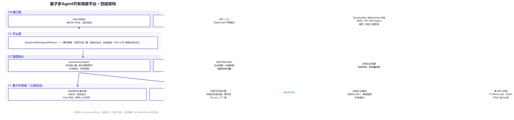

每一批任务都经历一次完整的「**编码 → 演化 → 观测**」量子过程——这是本平台与「用量子词汇装饰的经典调度器」的本质区别：

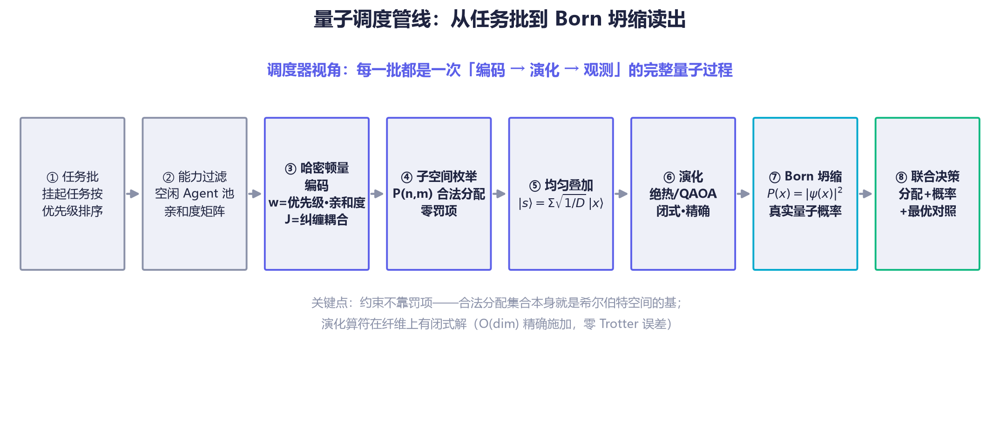

| 概念 | 隐喻期 | 物理实现 |
|---|:---|:---|
| **叠加态** | 随机 `amplitude` 装饰字段 | 全部合法分配共存于 P(n,m) 维希尔伯特空间，复振幅 |
| **演化** | 无（直接加权评分） | 薛定谔方程数值积分：QAOA 变分 / 绝热退火 |
| **坍缩** | `probability` = 分数归一化 | **Born 规则**：P(x) = \|ψ(x)\|²，决策概率是真实量子概率 |
| **纠缠** | 字符串数组（调度无视） | **哈密顿量耦合项** J·x₁x₂，改变基态（最优解） |

## ⚛️ 量子调度核心：原理

### 1. 调度问题 → 物理问题：哈密顿量编码

调度器把「m 个任务分给 n 个 agent」编码为对角代价哈密顿量：亲和度矩阵 `w` 进入对角（单点价值），agent 间的纠缠对进入耦合项 `J`（协作增益 / 冲突惩罚）。耦合项会**移动基态**——即改变最优联合分配，这是被测试钉住的对照面：

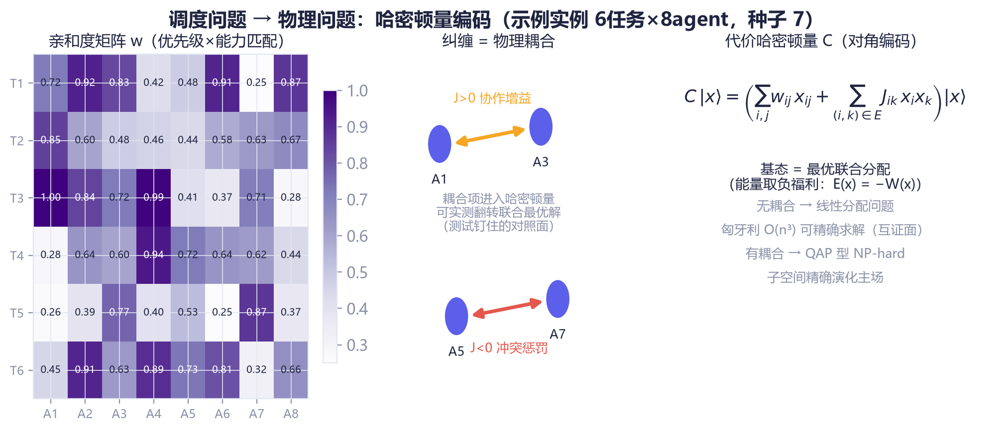

无耦合时问题退化为线性分配问题（匈牙利 O(n³) 精确可解，成为互证面）；有耦合时为 QAP 型 NP-hard——这正是子空间精确演化的主场。

### 2. 约束子空间：为什么「等效 80 量子比特」是可能的

直接模拟 8 任务 × 10 agent 需要 2⁸⁰ ≈ 1.2×10²⁴ 维态矢量（约 10¹⁵ TB 内存）；但**合法分配只有 P(n,m) = n!/(n−m)! = 1,814,400 个**——「每任务恰占一个不同 agent」的约束直接长在基上，罚项为零：

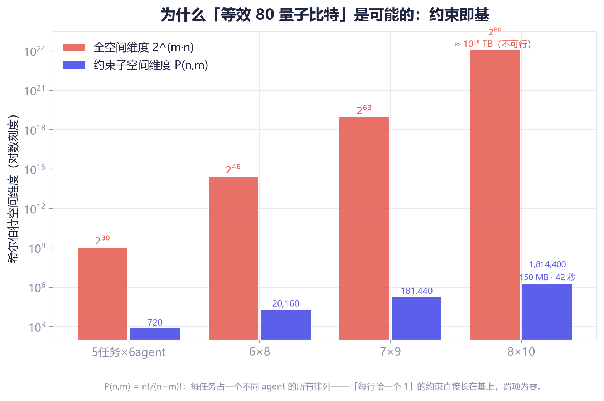

| | 全空间态矢量 | 约束子空间 |
|---|---|---|
| 希尔伯特维度 | 2^(m·n) | **P(n,m) = n!/(n−m)!** |
| 8任务×10agent | 2⁸⁰ ≈ 1.2×10²⁴ 维（≈10¹⁵ TB，不可行） | **1,814,400 维（≈150 MB，42 秒精确解）** |
| 约束处理 | 二次罚项（能量尺度压缩风险） | **内建于子空间（零罚项）** |
| 混合算符 | X 旋转（逐比特） | **纤维完全图旋转（闭式精确）** |

### 3. 纤维混合器：约束子空间上的闭式幺正

把「移动单个任务的指派」看作图上的邻接算符——固定其余任务后，单任务的自由落点构成**完全图 K_k = J − I**，其矩阵指数有闭式解，混合层可逐纤维**精确**施加、O(dim) 完成、零 Trotter 误差。绝热初态取均匀叠加：由 Perron–Frobenius 定理，非负邻接阵的顶本征矢恰为 −ΣA 的基态——初态即基态，无制备缺口。n = m 时自动切换换位混合器：

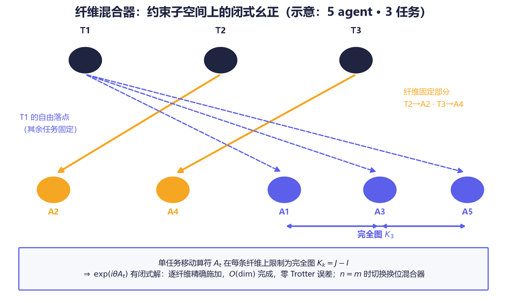

### 4. QAOA 变分电路与 ma-QAOA 构造性支配

全空间引擎实现交替层 QAOA（代价层 `e^{−iγC}` × 混合层，p 层，坐标下降离线优化角度）；v1.10 引入 **ma-QAOA**（逐算子变分角）：

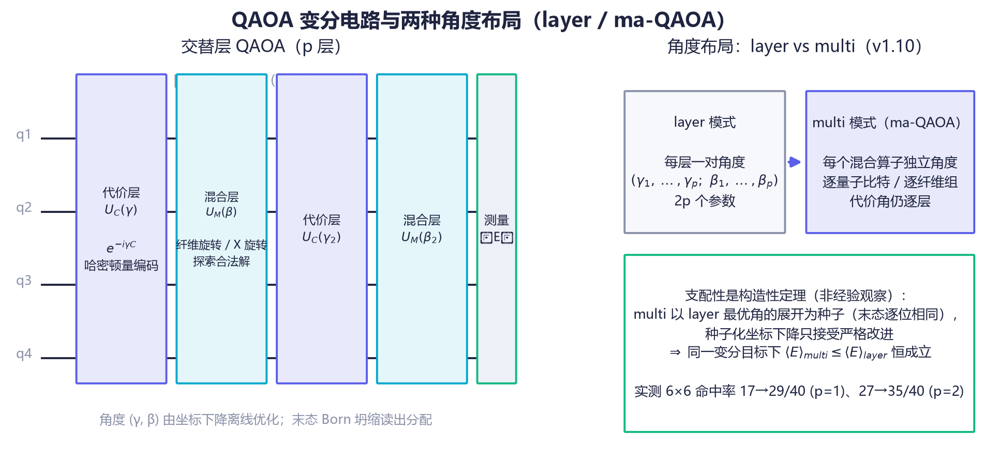

**支配性是构造性定理，不是经验观察**：multi 模式以 layer 最优角的展开态为种子（末态逐位相同），种子化坐标下降只接受严格改进 ⇒ 同一变分目标下 ⟨E⟩_multi ≤ ⟨E⟩_layer 恒成立。子空间变分区实测增益显著，全空间坍缩读数已饱和——如实不宣称收益，定理保证的支配依旧成立：

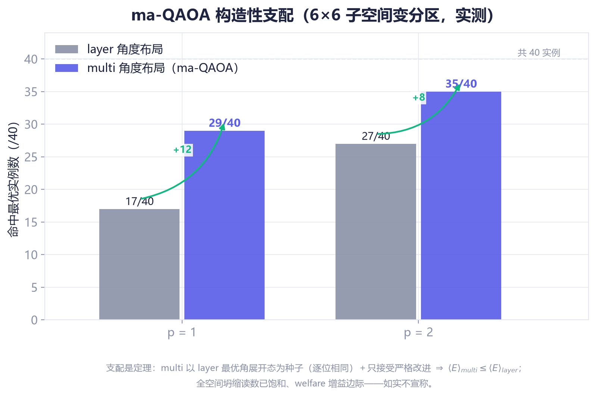

### 5. 绝热退火：慢过临界点，基态全程跟随

子空间默认算法是绝热演化：H(s) = (1−s)·(−ΣA) + s·C 在离散 s 网格上数值积分（默认 τ=20、steps=150），代价相位走复乘递推、纤维旋转闭式施加——**每一步都是精确幺正**：

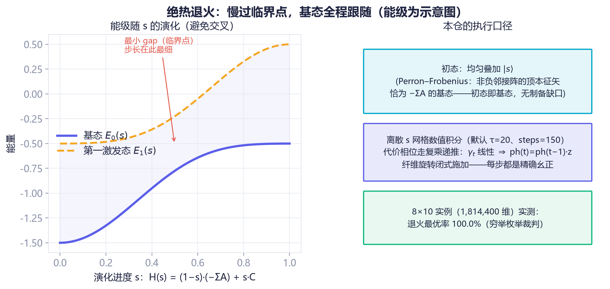

### 6. Born 坍缩：概率就是振幅的模方

演化的终点是一次真实的量子观测：末态振幅按 Born 规则坍缩为决策概率。调度器的 `decision.probability` 是**真实量子概率**而非分数归一化；top-K 候选用线性选择（O(dim)）取代全量排序：

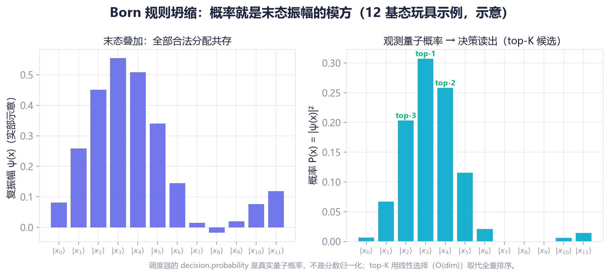

## 📊 实测战绩：Benchmarks

> 🧪 **可复现**：`npm run bench` 一条命令重跑全部对照（**50 实例 × 7 求解器**，`npm run bench:regenerate` 从公开种子重建实例族），机器可读报告输出到 `out/bench/bench-report.{json,md}`。下图全部由该报告渲染；**裁判永远是穷举枚举，双方计同一本账**。

### 1️⃣ 子空间规模阶梯

等效 30 → 80 量子比特，四档退火最优率全部 **100.0%**（穷举裁判）：

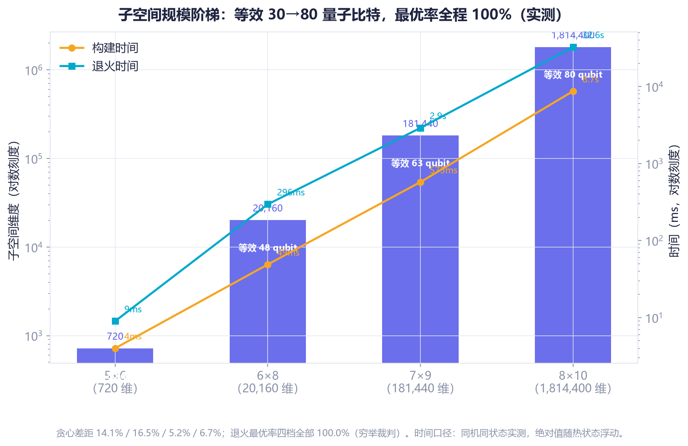

| 实例 | 等效量子比特 | 子空间维度 | 构建 | 退火 | **退火最优率** |
|---|---|---|---|---|---|
| 5×6 | 30 | 720 | 4 ms | 9 ms | **100.0%** |
| 6×8 | 48 | 20,160 | 49 ms | 296 ms | **100.0%** |
| 7×9 | 63 | 181,440 | 575 ms | 2.9 s | **100.0%** |
| 8×10 | 80 | 1,814,400 | 8.7 s | 32.6 s | **100.0%** |

### 2️⃣ 线性赛道：量子 × 匈牙利逐点一致（独立算法互证）

25 个无耦合实例上，量子子空间引擎与匈牙利 O(n³) **双双 25/25 逐点命中最优**——两种完全独立的算法落在同一条对角线上：

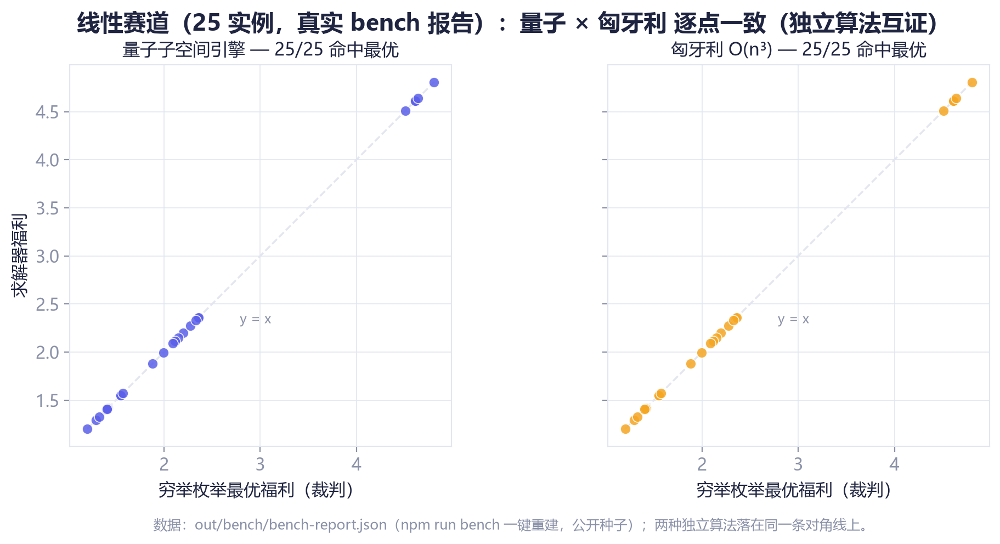

### 3️⃣ 耦合赛道：NP-hard 上量子 5/5 全胜

纠缠耦合使问题成为 QAP 型 NP-hard（6×8 × 5 公开种子，统一记账）：

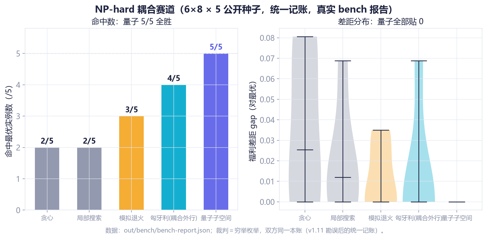

| 方法 | 命中最优 |
|---|---|
| 贪心 Greedy | 2/5 |
| 局部搜索 Local search | 2/5 |
| 模拟退火 Simulated annealing | 3/5 |
| **量子子空间 Quantum subspace** | **5/5** ✅ |

> ⚠️ **勘误（v1.11，由 QuantumSched-Bench 定罪）**：本表早期版本载「贪心 0/5、局部搜索 0/5」——那是示例脚本给经典侧只记不含耦合加成的半账、却对照含耦合的最优所致的记账 Artifact；统一记账下经典侧实为 2/5。量子侧 5/5 与线性侧逐点一致原样复现，胜负结论不变。

### 4️⃣ 确定性并行演化（v1.6）

量子管线三阶段重写并跨核并行：纤维尺寸查表消除逐纤维三角函数、退火代价相位复乘递推、坍缩 top-K 线性选择（~500×）。大维度经 `worker_threads + SharedArrayBuffer + Atomics` 屏障多线程执行——**并行 = 确定性**，与串行路径共享同一份内核源码，结果逐位一致（测试逐位断言钉死）：

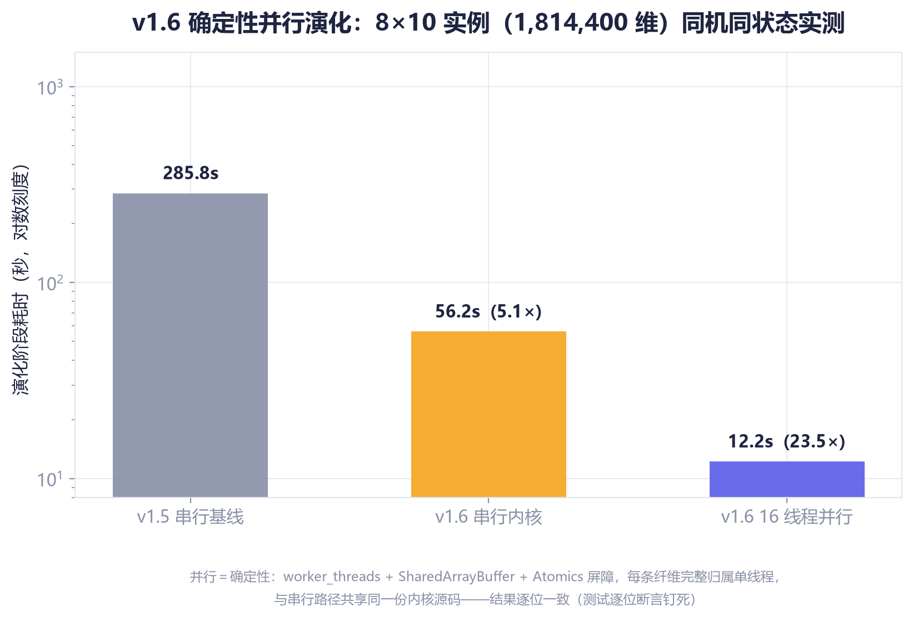

同机同状态实测（8×10，1,814,400 维，i9-12900H，20 逻辑核）：演化串行内核 285.8 s → 56.2 s（**5.1×**），16 线程 **12.2 s（23.5×）**；构建 5.0×；坍缩 top-K ~500×。绝对时间随热状态浮动，**相对倍数**是稳定口径。

### 5️⃣ 平台热路径性能（经典 hybrid 模式）

`npm run performance` 一键复现（实测环境 Node.js v24 / Windows / 2026-08）：

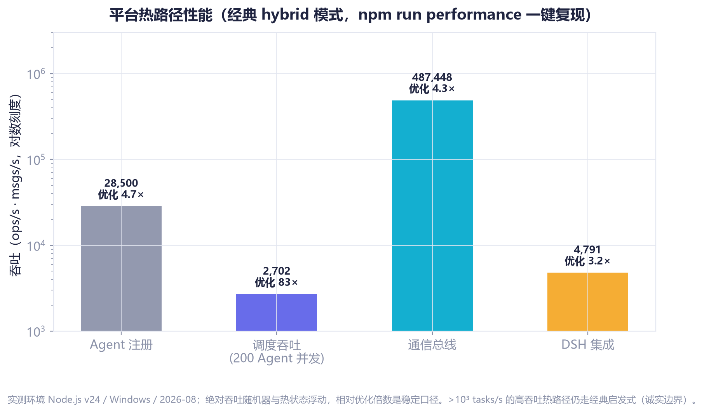

| 指标 | 吞吐 | 优化倍数 |
|---|---|---|
| Agent 注册 | 28,500 ops/s | 4.7× |
| 调度吞吐（200 Agent 并发） | 2,702 ops/s | **83×** |
| 通信总线 | 487,448 msgs/s | 4.3× |
| DSH 集成 | 4,791 ops/s | 3.2× |

## 🔌 真 QPU 后端与执行分级路由

量子核心是薛定谔方程的**经典精确模拟**；`toIsing()` 导出的 (h, J) 可直接提交真实量子退火机，同一问题无需改代码即可换执行位置。**D-Wave Leap（REST）**真机采样经三道闸门（合法性校验 · 噪声过滤 · 最优率对照）后才进调度器；**IBM Qiskit 导出**产出可运行程序（内嵌仓内训练好的 QAOA 角度）；v1.11 起**FTQC 执行分级**——提交前先过资源估算器，每个数字都带来源与假设注释，三态路由由 14 个测试钉住：

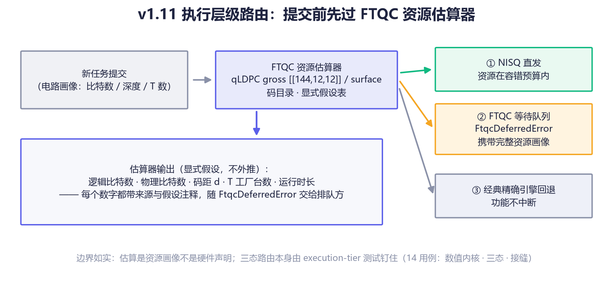

## 🧠 市场机制研究线

与量子核心并行的研究主线：把任务分配建模为**智力资本市场**——每个分配同时是消费决策（当期净价值）与投资决策（学习资本的增长影子价值 g）。结算流在线校准学习曲线 q̂(k)，增广 WDP 求解，Clarke pivot 支付保证 DSIC：

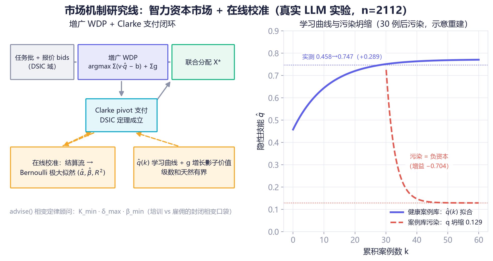

**关键实测结论**（真实 glm-4-flash，n=2112）：隐性技能随案例积累上升——q: 0.458 → 0.747（**+0.289**，α≈0.58，β≈0.09，z=2.77）；污染案例库是负资本——q 坍缩至 0.129（增益 −0.704）；培训 vs 雇佣存在封闭相变口袋（L1–L4 闭式定律 + Buckingham π 普适标度）。

## 🧪 质量门禁体系

**520 用例 · 0 失败 · 48 个测试文件 / 152 个套件**；六道门禁全绿，覆盖率棘轮只升不降：

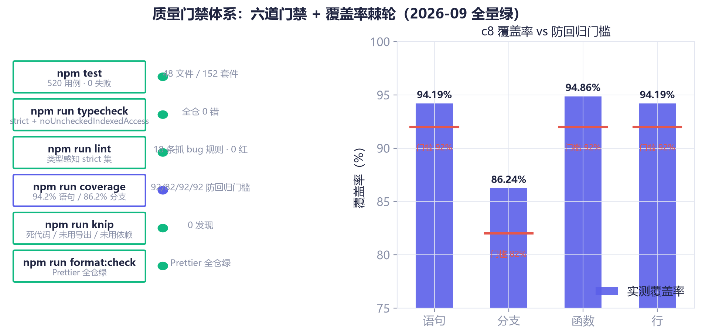

`npm test` / `typecheck`（strict + noUncheckedIndexedAccess 全仓 0 错）/ `lint`（类型感知 strict 集 18 条抓 bug 规则）/ `coverage`（94.2% 语句 / 86.2% 分支，92/82/92/92 防回归门槛）/ `knip`（死代码 0 发现）/ `format:check`。运行时依赖收敛为 `ws` 一项，0 供应链告警。

## 🗓️ 版本演进时间线

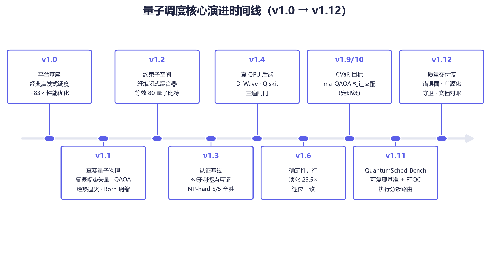

**v1.0** 平台基座（经典启发式 + 83× 性能优化）→ **v1.1** 真实量子物理 → **v1.2** 约束子空间 → **v1.3** 认证基线 → **v1.4** 真 QPU 后端 → **v1.6** 确定性并行（23.5×，逐位一致）→ **v1.9/10** CVaR + ma-QAOA（定理级支配）→ **v1.11** QuantumSched-Bench + FTQC 分级 → **v1.12** 质量交付波（错误面收敛 · 单源化孪生收敛 · 本图集）。

---

## 🔬 研究线子项目索引

主平台之外，仓库承载一批独立记账的研究线子项目：每个都把一个论文级命题做成**可执行、可证伪、带价目表**的工件——定理层先机器验证，损失如实入账。

| 目录 | 一句话简介 |
|---|---|
| [`binding-price`](./binding-price/README.md) | 账本第 13 行的市场执行：隐私可以买，绑定买不走 |
| [`bqp-map`](./bqp-map/README.md) | BQP × NP 调度复杂度地图集 |
| [`burial-record`](./burial-record/README.md) | 埋葬档案的出土与机器审计 |
| [`causal-ineq`](./causal-ineq/README.md) | 因果不等式的可执行化 |
| [`choice-lang`](./choice-lang/README.md) | 「选择」作为语言原语的首个可执行模型（里程碑 #15，无需硬件） |
| [`depreciation-ledger`](./depreciation-ledger/README.md) | claim #17 升格为构建门禁的折旧账本 |
| [`dsic-noether`](./dsic-noether/README.md) | 机制设计的对称层：DSIC × Noether 双层执行（roadmap #12） |
| [`dtc-clock`](./dtc-clock/) | 时间晶体时钟墙的模型层执行：驱动节拍、可逆通用门集、热力学价目表（row #10） |
| [`ent-clearing`](./ent-clearing/README.md) | 纠缠标准的结算层 |
| [`ent-sched`](./ent-sched/README.md) | 分布式纠缠调度原型（未来技术版图 #3） |
| [`ft-qaoa`](./ft-qaoa/README.md) | 容错深度 QAOA 路线原型 |
| [`k-switch`](./k-switch/README.md) | k! 个拓扑序上的序叠加，可执行 |
| [`letter-audit`](./letter-audit/README.md) | 「信」的全文审计——升级方法反过来也审计自己的登记处 |
| [`mutant-census`](./mutant-census/README.md) | 突变体名册：错误面登记与族谱审计 |
| [`nonstoq-anneal`](./nonstoq-anneal/README.md) | 非 stoquastic 退火路线原型 |
| [`nosignal-tariff`](./nosignal-tariff/README.md) | 无信号关税的单页明细 |
| [`phase-law`](./phase-law/) | 组合相位律：经典启发式在耦合分配赛道于何处丢失精确最优（λ* 阈值 / 景观机制 / 标度，裁判恒为穷举） |
| [`postselect-sched`](./postselect-sched/README.md) | 后选择调度：多世界分拣器作为可调度原语 |
| [`qram-sched`](./qram-sched/README.md) | qRAM 加速在线调度：定理层，机器验证 |
| [`quantum-mech`](./quantum-mech/README.md) | 量子机制设计原型（未来技术版图 #4） |
| [`qverify`](./qverify/README.md) | 委托计算验证背后的定理层的机器验证 |
| [`readout-wall`](./readout-wall/README.md) | 不定因果序的测量墙，汇率账本化执行 |
| [`retro-cache`](./retro-cache/README.md) | 无信号关税的追溯缓存账本 |
| [`route-price`](./route-price/README.md) | 地图集两条 OPEN 行的路线与定价 |
| [`stable-world`](./stable-world/README.md) | 稳定性作为物理而非编译（row #15 的成本列） |
| [`survivor-census`](./survivor-census/README.md) | 多世界分拣器实际保留了谁 |
| [`switch-sched`](./switch-sched/README.md) | 不定因果序定理层的可执行化 |
| [`vacuum-compiler`](./vacuum-compiler/README.md) | 基态编译器（roadmap #11），带能量账本 |
| [`wukong-crossval`](./wukong-crossval/README.md) | 本地精确引擎 × 真 QPU 交叉验证管线（本源悟空机时申请配套） |

## 📁 仓库导览

| 路径 | 内容 |
|---|---|
| [`ds_extracted/ds/`](./ds_extracted/ds/README.md) | ⚛️ 主平台（本页全部原理图与基准的源头） |
| [`DELIVERY/`](./DELIVERY) | 交付物：代码质量审计报告（txt/html/docx）、升级实施与质量波计划 |
| [`.cluster/`](./.cluster) | 多智能体集群工程留痕（代码质量审计、升级工程两次会战） |
| [`.formwork/`](./.formwork) | 仓库元工具：打包 / 补丁 / 元数据脚本 |
| [`.github/`](./.github) | CI（`ci.yml`）与 `publish.yml` workflow、Dependabot |

> 主平台路径名 `ds_extracted/ds` 源于工程史上的解包命名，以仓内 README 为准。

## 🚀 复现入口（主平台）

```bash
git clone https://github.com/beijingwahw/quantum-multi-agent-platform.git
cd quantum-multi-agent-platform/ds_extracted/ds
npm install

npm test                # 520 用例 · 0 失败
npm run bench           # QuantumSched-Bench：50 实例 × 7 求解器
npm run diagrams        # 重建本页全部 18 张原理图 + 三道机器视觉自检
npm run coverage        # c8 覆盖率 vs 防回归门槛棘轮
npm run performance     # 热路径性能复现
npm run example:quantum # 量子突破基准（7 部分）
npm run example:qpu     # 真 QPU 入口（自动检测 DWAVE_API_TOKEN）
npm run dev             # 启动平台（WS :8080）
```

原理图重渲染：`python docs/diagrams/generate.py`（需 matplotlib，中文用微软雅黑）；数据来源 `out/bench/bench-report.json`（`npm run bench` 产物）+ 公开实测数字。各研究线子项目自带测试与记账，入口见各自目录。

## ⚠️ 诚实的边界

1. 量子核心是薛定谔方程的**经典精确模拟**，不是真 QPU；`toIsing()` 导出的 (h,J) 可直接提交真实量子退火机，届时同一问题无需改代码即可换执行位置。
2. 子空间维度仍组合增长 P(n,m)，默认上限 2²⁰（≈150MB 内存）；8×10 规模为**决策质量模式**而非热路径——v1.6 内核使其演化提速 23.5×（同机同状态，16 线程并行，与串行逐位一致），绝对耗时随机器核数与热状态浮动。
3. 高吞吐热路径（>10³ tasks/s）仍走经典 `hybrid` 启发式。
4. 所有最优率/概率均为末态真实观测量；耦合赛道的最优对照来自子空间枚举（≤2²¹ 维时精确），不做外推。
5. 图集中退火能级、Born 分布与纤维结构为**按公式解析绘制的示意图**（图题已标注）；一切实测数字以命令产物为准（`npm test` / `npm run bench` / `npm run performance`）。

## 📄 许可

MIT © Quantum Agent Team
