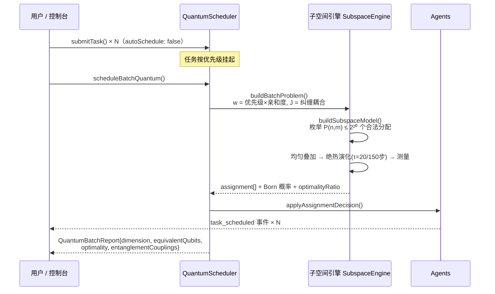

# ⚛️ 量子多Agent开发调度平台

# Quantum Multi-Agent Development & Scheduling Platform

> 🇬🇧 **English version**: [README.en.md](./README.en.md)（图内文字为中文，图注附英文关键词）


一个把**真实量子算法**（QAOA / 绝热量子退火 / Born 测量坍缩）作为调度决策引擎的多Agent平台：任务分配被编码为哈密顿量，在约束子空间上**精确演化**——联合调度规模达**等效 80 量子比特**（全空间模拟需 10¹⁵ TB 内存，宇宙尺度不可行），且在 NP-hard 耦合赛道上 **5/5 精确命中最优**（最强经典对手 3/5；`npm run bench` 一键复现，v1.11 统一记账勘误见[基准节](#-基准与性能-benchmarks--performance)）。


本 README 的全部原理图由仓内脚本 [`docs/diagrams/generate.py`](./docs/diagrams/generate.py) 从**真实工件**（`out/bench/bench-report.json` 机器可读基准报告 + 公开实测数字）渲染，`python docs/diagrams/generate.py` 一键重建。

---

## 📑 目录

| | 章节 | 看点 |
|---|---|---|
| ✨ | [核心能力](#-核心能力) | 八项能力一览 |
| 🏗️ | [架构总览](#️-架构总览) | 四层架构 |
| ⚛️ | [量子调度核心](#️-量子调度核心) | 管线 · 哈密顿量 · 子空间 · 纤维 · QAOA · 退火 · Born |
| 🔌 | [真 QPU 与执行分级](#-真-qpu-后端与执行分级路由) | D-Wave · Qiskit · FTQC 三态路由 |
| 🧠 | [市场机制研究线](#-市场机制研究线) | 增广 WDP · DSIC · 学习曲线 |
| 📊 | [基准与性能](#-基准与性能) | 量子 5/5 · 匈牙利互证 · 23.5× 并行 |
| 🚀 | [快速开始](#-快速开始) | 十条命令 + 代码示例 |
| 🧪 | [测试与质量](#-测试与质量) | 520 用例 · 六门禁 · 覆盖率棘轮 |
| 📁 | [目录结构](#-目录结构) | 含图集生成器 |
| 🗓️ | [版本演进](#️-版本演进时间线) | v1.0 → v1.12 |
| ⚠️ | [诚实的边界](#️-诚实的边界) | 等效≠真机 · 组合爆炸 · 热路径 |

---

## ✨ 核心能力

| | 能力 |
|---|---|
| ⚛️ | **真实量子物理引擎**：复振幅态矢量、幺正演化（范数恒为 1.000000000000）、QAOA 变分电路、绝热退火、Born 规则测量坍缩 |
| 🌌 | **约束子空间突破**：在合法分配集合（维度 P(n,m)）上精确演化，零罚项、纤维混合器闭式解，等效 80 量子比特 |
| 🔗 | **纠缠 = 物理耦合**：agent 纠缠对进入哈密顿量耦合项，实测可翻转联合最优解 |
| 🏆 | **认证经典基线**：线性赛道与匈牙利算法 O(n³) 逐点一致（独立算法互证）；NP-hard 耦合赛道 5/5 全胜 |
| 🔌 | **真 QPU 后端层**：D-Wave Leap REST 客户端（真量子退火硬件）+ IBM Qiskit 程序导出 + 本地精确引擎自动回退 |
| 🧭 | **执行层级路由（v1.11）**：FTQC 资源估算器（qLDPC gross [[144,12,12]]/surface 码目录，显式假设）在提交前判定任务发 NISQ、转 FTQC 等待队列（`FtqcDeferredError` 携带资源画像）或回退经典精确引擎 |
| 🧠 | **市场机制研究线**：CompoundBrain 增长复利大脑（DSIC 定理 + 在线学习曲线校准）、批量 VCG、相变定律 |
| 🔌 | **完整平台能力**：WebSocket 总线（487,448 msgs/s）、DSH 工具/工作流集成、Web 控制台、主动智能规则插件 |

---

## 🏗️ 架构总览

平台分四层：**接口层**（Web 控制台 / SDK / WebSocket 总线）→ **平台层**（事件编排与快照广播）→ **调度核心**（优先级分桶、能力索引、并发背压）→ **量子引擎层**（全空间态矢量与约束子空间两套精确引擎，经典基线作对照，真 QPU 后端可切换）。市场机制研究线与主动智能插件通过 `MarketBrain` 接口接入，是独立的机制研究核心。


如上管线图所示，每一批任务都经历一次完整的「编码 → 演化 → 观测」量子过程——这是本平台与"用量子词汇装饰的经典调度器"的本质区别（对照表见[量子调度核心](#-量子调度核心)节）。

---

## ⚛️ 量子调度核心

### 从隐喻到物理

| 概念 | v1.0（隐喻） | v1.3+（物理实现） |
|---|:---|:---|
| **叠加态** | 随机 `amplitude` 装饰字段 | 全部合法分配共存于 P(n,m) 维希尔伯特空间，复振幅 |
| **演化** | 无（直接加权评分） | 薛定谔方程数值积分：QAOA 变分 / 绝热退火 |
| **坍缩** | `probability` = 分数归一化 | **Born 规则**：P(x) = \|ψ(x)\|²，决策概率是真实量子概率 |
| **纠缠** | 字符串数组（调度无视） | **哈密顿量耦合项** J·x₁x₂，改变基态（最优解） |

### 1. 调度问题 → 物理问题：哈密顿量编码

调度器把「m 个任务分给 n 个 agent」编码为一个对角代价哈密顿量：亲和度矩阵 `w` 进入对角（单点价值），agent 间的纠缠对进入耦合项 `J`（协作增益/冲突惩罚）——耦合项会**移动基态**，即改变最优联合分配，这是被测试钉住的对照面。


无耦合时问题退化为线性分配问题（匈牙利 O(n³) 可精确求解，成为互证面）；有耦合时为 QAP 型 NP-hard——这正是子空间精确演化的主场。

### 2. 约束子空间：为什么「等效 80 量子比特」是可能的

直接模拟 8任务×10agent 需要 2⁸⁰ ≈ 1.2×10²⁴ 维态矢量（约 10¹⁵ TB 内存）；但**合法分配只有 P(n,m) = n!/(n−m)! = 1,814,400 个**——「每任务恰占一个不同 agent」的约束直接长在基上，罚项为零：


| | 全空间态矢量 | 约束子空间 |
|---|---|---|
| 希尔伯特维度 | 2^(m·n) | **P(n,m) = n!/(n−m)!** |
| 8任务×10agent | 2⁸⁰ ≈ 1.2×10²⁴ 维（≈10¹⁵ TB，不可行） | **1,814,400 维（≈150 MB，42 秒精确解）** |
| 约束处理 | 二次罚项（能量尺度压缩风险） | **内建于子空间（零罚项）** |
| 混合算符 | X 旋转（逐比特） | **纤维完全图旋转（闭式精确）** |

### 3. 纤维混合器：约束子空间上的闭式幺正

子空间引擎的核心构造：把「移动单个任务的指派」看作图上的邻接算符——固定其余任务后，单任务的自由落点构成**完全图 K_k = J − I**，其矩阵指数有闭式解，于是混合层可以逐纤维**精确**施加、O(dim) 完成、零 Trotter 误差：


绝热初态取均匀叠加：由 Perron–Frobenius 定理，非负邻接阵的顶本征矢恰为 −ΣA 的基态——初态即初哈密顿量基态，无制备缺口。n = m 时自动切换换位（transposition）混合器。

### 4. QAOA 变分电路与两种角度布局

全空间引擎实现交替层 QAOA（代价层 `e^{−iγC}` × 混合层，p 层，坐标下降离线优化角度）；v1.10 引入 **ma-QAOA**（逐算子变分角）：


**支配性是构造性定理，不是经验观察**：multi 模式以 layer 最优角的展开态为种子（末态逐位相同），种子化坐标下降只接受严格改进 ⇒ 同一变分目标下 ⟨E⟩_multi ≤ ⟨E⟩_layer 恒成立。子空间变分 regime 实测增益显著（下图），全空间坍缩读数已饱和——如实不宣称收益，定理保证的支配依旧成立：


另支持 **CVaR 分位数目标**（`cvarAlpha`，v1.9）：只优化"最好的那 α 概率质量"，按能量升序预排序的**精确态矢量 CVaR**（无 shot 采样噪声）；在坍缩已近饱和的读数上 CVaR 有害——不宣称（`tests/cvar-qaoa.test.ts` 钉住）。

### 5. 绝热退火：慢过临界点，基态全程跟随

子空间默认算法是绝热演化：H(s) = (1−s)·(−ΣA) + s·C 在离散 s 网格上数值积分（默认 τ=20、steps=150），代价相位走复乘递推、纤维旋转闭式施加——**每一步都是精确幺正**：


### 6. Born 坍缩：概率就是振幅的模方

演化的终点是一次真实的量子观测：末态振幅按 Born 规则坍缩为决策概率，调度器的 `decision.probability` 是**真实量子概率**而非分数归一化；top-K 候选用线性选择（O(dim)）取代全量排序：


### 批量调度时序



---

## 🔌 真 QPU 后端与执行分级路由

量子核心是薛定谔方程的**经典精确模拟**；`toIsing()` 导出的 (h, J) 可直接提交真实量子退火机，届时同一问题无需改代码即可换执行位置。真机采样经**三道闸门**（合法性校验 · 噪声过滤 · 最优率对照）后才进调度器：

- **D-Wave Leap（REST）**：[cloud.dwavesys.com/leap](https://cloud.dwavesys.com/leap) 注册（免费额度）→ `set DWAVE_API_TOKEN=<token>` → `npm run example:qpu`；无凭据时自动回退本地精确引擎（功能不中断）。
- **IBM Qiskit 导出**：`toQiskitProgram()` 产出可运行的 Qiskit 程序（内嵌本仓训练好的 QAOA 角度）。
- **FTQC 执行分级（v1.11）**：提交前先过资源估算器——每个数字都带来源与假设注释，三态路由本身由 14 个测试钉住：


---

## 🧠 市场机制研究线

与量子核心并行的研究主线：把任务分配建模为**智力资本市场**——每个分配同时是消费决策（当期净价值）与投资决策（学习资本的增长影子价值 g）。结算流在线校准学习曲线 q̂(k)，增广 WDP 求解，Clarke pivot 支付保证 DSIC：


**关键实测结论**（真实 glm-4-flash，n=2112）：

| 发现 | 数据 |
|---|---|
| 隐性技能随案例积累上升 | q: 0.458 → 0.747（**+0.289**，α≈0.58，β≈0.09，z=2.77） |
| 污染案例库是负资本 | q 坍缩至 0.129（增益 −0.704） |
| 培训 vs 雇佣存在封闭相变口袋 | L1–L4 闭式定律 + Buckingham π 普适标度 |

---

## 📊 基准与性能

> 🧪 **v1.11 起可复现**：`npm run bench` 一条命令重跑全部对照（50 实例 × 7 求解器，`npm run bench:regenerate` 从公开种子重建实例族），机器可读报告输出到 `out/bench/bench-report.{json,md}`。下节图表即由该报告渲染；**裁判永远是穷举枚举，双方计同一本账**。

### 1️⃣ 子空间规模阶梯

等效 30 → 80 量子比特，四档退火最优率全部 **100.0%**（穷举裁判）：


| 实例 | 等效量子比特 | 全空间维度 | 子空间维度 | 构建 | 退火 | 贪心差距 | **退火最优率** |
|---|---|---|---|---|---|---|---|
| 5×6 | 30 | 2³⁰ | 720 | 4 ms | 9 ms | 14.1% | **100.0%** |
| 6×8 | 48 | 2⁴⁸ | 20,160 | 49 ms | 296 ms | 16.5% | **100.0%** |
| 7×9 | 63 | 2⁶³ | 181,440 | 575 ms | 2.9 s | 5.2% | **100.0%** |
| 8×10 | 80 | 2⁸⁰ ≈ 1.2×10²⁴ | 1,814,400 | 8.7 s | 32.6 s | 6.7% | **100.0%** |

### 2️⃣ 线性赛道：量子 × 匈牙利 逐点一致（独立算法互证）

25 个无耦合实例（含 6×8）上，量子子空间引擎与匈牙利 O(n³) **双双 25/25 逐点命中最优**——两种完全独立的算法落在同一条对角线上：


### 3️⃣ 耦合赛道：NP-hard 上量子 5/5 全胜

纠缠耦合使问题成为 QAP 型 NP-hard（6×8 × 5 公开种子，统一记账）：


| 方法 | 命中最优 |
|---|---|
| 贪心 Greedy | 2/5 |
| 局部搜索 Local search | 2/5 |
| 模拟退火 Simulated annealing | 3/5 |
| **量子子空间 Quantum subspace** | **5/5** ✅ |

> ⚠️ **勘误（v1.11，由 QuantumSched-Bench 定罪）**：本表早期版本载"贪心 0/5、局部搜索 0/5"——那是示例脚本给经典侧只记**不含耦合加成的半账**、却对照含耦合的最优所致的记账 Artifact；统一记账下经典侧实为 2/5。量子侧 5/5 与线性侧逐点一致原样复现，胜负结论不变（5/5 vs 最强经典 3/5），差距数字如实修正。

### 4️⃣ 确定性并行演化（v1.6）

量子管线全部三阶段（构建→演化→坍缩）重写并跨核并行：纤维尺寸查表消除逐纤维三角函数（8×10 实例曾需 29 亿次 `Math.cos/sin`）、退火代价相位复乘递推、构建期字典序单调键 + 二分查找、坍缩 top-K 线性选择（~500×）。大维度经 `worker_threads + SharedArrayBuffer + Atomics` 屏障多线程执行——**并行 = 确定性**，与串行路径共享同一份内核源码，结果逐位一致（测试逐位断言钉死）：


同机同状态实测（8×10，1,814,400 维，i9-12900H，20 逻辑核）：

| 管线阶段 | v1.5 | v1.6 | 提升 |
|---|---|---|---|
| 演化（串行内核） | 285.8 s* | 56.2 s | **5.1×** |
| 演化（16 线程） | — | 12.2 s | **23.5×** |
| 构建（DFS+能量+纤维组） | 14.5 s | 2.9 s | **5.0×**（纤维组八组并行，逐位一致） |
| 坍缩 top-K 候选 | ~6.7 s | ~0.01 s | **~500×** |

\* 同场对比基准（同一进程内逐字复刻优化前内核）；绝对时间随热状态浮动，**相对倍数**是稳定口径。并行失败自动回退串行；开关：`QUANTUM_WORKERS=<n>` / `QUANTUM_DISABLE_PARALLEL=1`。

### 5️⃣ 平台热路径性能（经典 hybrid 模式）

`npm run performance` 一键复现（实测环境 Node.js v24 / Windows / 2026-08；绝对吞吐随机器与热状态浮动，相对优化倍数是稳定口径）：


| 指标 | 吞吐 | 优化倍数 |
|---|---|---|
| Agent 注册 | 28,500 ops/s | 4.7× |
| 调度吞吐（200 Agent 并发） | 2,702 ops/s | **83×** |
| 通信总线 | 487,448 msgs/s | 4.3× |
| DSH 集成 | 4,791 ops/s | 3.2× |

---

## 🚀 快速开始

```bash
git clone https://github.com/beijingwahw/quantum-multi-agent-platform.git
cd quantum-multi-agent-platform
npm install

npm test                # 520 用例 · 0 失败
npm run typecheck       # 全仓类型检查（strict + noUncheckedIndexedAccess）
npm run lint            # ESLint（typescript-eslint 推荐规则集）
npm run example:basic   # 基础用法全链路（平台启停/调度/控制台协议）
npm run example:advanced # 高级工作流（纠缠/依赖/批量调度）
npm run example:quantum # 量子突破基准（7 部分）
npm run example:qpu     # 真 QPU 入口（自动检测 DWAVE_API_TOKEN）
npm run bench           # QuantumSched-Bench 全量对照（50 实例 × 7 求解器）
npm run dev             # 启动平台（WS :8080）
```

> 端口口径（06#6）：架构图与 `npm run dev` 的 :8080 是**平台默认端口**；示例刻意错开（basic=8081、advanced=8083），为的是示例可与运行中的 dev 平台并存不打架。两套端口都是配置项，不是硬编码约定。

### 批量联合量子调度

```typescript
import { QuantumScheduler } from './src/index.js';

const scheduler = new QuantumScheduler({
  scheduling: {
    quantumAlgorithm: 'quantum-annealing', // 或 'quantum-qaoa' | 'hybrid'（默认经典）
    autoSchedule: false,                   // 攒任务做联合调度 | batch mode
    quantum: { subspaceCap: 1 << 20, anneal: { tau: 20, steps: 150 } }
  }
});

scheduler.registerAgent({ id: 'a1', name: 'Dev-1', type: 'developer',
  capabilities: ['typescript'], state: 'idle', load: 0,
  position: { x: 0, y: 0, z: 0 }, quantumEntanglement: ['a2'], lastHeartbeat: new Date() });
// ... 注册更多 agent，提交多个任务 ...

const report = scheduler.scheduleBatchQuantum();
console.log(report.representation);        // 'subspace'
console.log(report.subspace);              // { dimension: P(n,m), equivalentQubits }
console.log(report.optimality);            // { achieved, optimal, ratio } 精确对照
console.log(report.assignments.map(a => `${a.taskName} → ${a.agentId} (p=${a.probability})`));
```

单任务模式（`autoSchedule: true`）下每次决策走"叠加 → 演化 → Born 坍缩"；默认 `hybrid` 路径与经典行为完全一致（零回归）。

---

## 🧪 测试与质量

**520 用例 · 0 失败 · 48 个测试文件 / 152 个套件**（1 项性能灵敏度用例按测量环境守卫自跳过）；六道门禁全绿，覆盖率棘轮只升不降：


| 套件 | 用例 | 覆盖 |
|---|---|---|
| `quantum-optimizer.test.ts` | 20 | 解析振幅 · 幺正性 · Born 分布 · Ising 导出逐点一致 |
| `subspace-optimizer.test.ts` | 10 | 维度 = P(n,m) · 纤维可逆性(机器精度) · 双引擎交叉验证 |
| `subspace-parallel.test.ts` | 11 | **并行=串行逐位一致** · 跨运行确定性 · 大维度最优 · 禁用回退 |
| `classical-baselines.test.ts` | 5 | **量子×匈牙利逐点一致** · 多轮调度 · 超维回退 |
| `qpu-backend.test.ts` | 12 | D-Wave 客户端**真实 HTTP 往返**(stub) · 双格式解析 · 轮询 · 调度器异步入口 |
| qiskit-selfcheck · qpu-crossval-smoke | 5 | Qiskit 导出自检 · QPU 跨验证冒烟 |
| CVaR / ma-QAOA（v1.9/v1.10） | 22 | CVaR 数学性质 · ma-QAOA 支配定理 · 位级等价 |
| execution-tier（v1.11 FTQC） | 14 | 资源估算数值内核 · 三态路由 · 接缝行为 |
| twin-convergence（v1.12 单源化） | 13 | 孪生收敛对拍 · 引擎级位同构回放 · 独立算法互证 |
| `security-hardening.test.ts` | 23 | 命令注入 · 沙箱逃逸 · 原型污染 · 引擎回归 |
| 调度/管理/通信/平台/控制台 | 50 | 平台全链路回归 · 控制台协议端到端 |
| DSH / 主动智能 | 35 | DSH 集成 · 插件全量 + 冒烟 |
| 市场机制（CompoundBrain/VCG/增长市场/相变） | 62 | DSIC · 校准 · 定律验证 |
| 回归/质量波（regression·wave1-3·quality·golden·audit·coverage·utils） | 202 | 回归钉板 · 黄金契约 · 属性测试 · 标注审计 · 工具域负对照 |
| tests/ 子目录（bench·mutation·sched-bench） | 36 | 基准诚实性 · 变异杀死 · 基准错误面负对照 |
| **全套** | **520** | **48 个测试文件 / 152 个套件 · 0 失败** |

（表内计数为文档对账时点一次绿色全量运行的快照；以 `npm test` 实时输出为准。）

```bash
npm run build     # TypeScript 严格模式 + noUncheckedIndexedAccess，0 错误
npm run typecheck # src+tests+examples 全仓类型检查
npm run lint      # ESLint 0 错误（类型感知 strict 集：no-floating-promises/
                  #   no-unnecessary-condition/prefer-nullish-coalescing/
                  #   no-base-to-string/no-unsafe-* 等 18 条抓 bug 规则）
npm run coverage  # c8 覆盖率 94.2% 语句 / 86.2% 分支，含 92/82/92/92 防回归门槛
npm run knip      # 死代码/未用导出/未用依赖 0 发现
npm test          # 520 用例 · 0 失败 ✅
npm run format    # Prettier 统一格式
```

**质量纪律（v1.7 起，逐版本棘轮）**：typescript-eslint recommendedTypeChecked 基座 + 精选严格规则（v1.7 修复 117 项源码违规）；v1.12 质量交付波完成错误面收敛（PlatformError 14 类层级）、单源化孪生收敛（四组、位同构对拍先行）、11 处静默垃圾路径守卫、21 处文档对账。运行时依赖收敛为 `ws` 一项（uuid 以原生 `crypto.randomUUID()` 取代，0 供应链告警）。

### 🔐 安全基线

工具面与控制台协议按不可信输入处理：

- **命令执行闸门**：程序白名单默认仅 tsc/git/ls/echo；解释器与包管理器等价于任意代码执行，须 `configureCommandPolicy()` 显式授权；`-e`/`--eval` 内联代码恒拒绝；引号外 shell 元字符一律拒绝；无 shell 数组直呼（Windows 借道 cmd 时 `/s`+verbatim 引用协议）；超时强制整树终止；`workdir` 须在白名单根内。
- **文件系统沙箱**：所有路径在真实路径（解引用符号链接，含悬空）上强制解析到沙箱根内；绝对路径、`../` 逃逸与符号链接逃逸直接拒绝。
- **总线鉴权与网络边界**：配置 `communication.authToken` 后全部流量路径须先 `authenticate`（SHA-256 后 `timingSafeEqual` 常数时间比较），已认证连接不得冒用他人 `sourceAgentId`；未配置时总线默认绑定 127.0.0.1；另有 maxConnections（默认 256）、4MB 慢消费者背压、单帧 maxMessageSize（默认 1MB）三层资源防线。
- **配置净化**：`deepMerge` 拒绝 `__proto__`/`constructor`/`prototype` 键。
- **QPU 凭据**：D-Wave endpoint 强制 https（本机调试除外），令牌从不落日志。

### 🎨 原理图集与复现

本 README 的 18 张原理图全部由 [`docs/diagrams/generate.py`](./docs/diagrams/generate.py) 渲染：

```bash
python docs/diagrams/generate.py   # 重建全部 18 张 PNG（需 matplotlib，中文用微软雅黑）
```

数据来源：`out/bench/bench-report.json`（`npm run bench` 产物）+ README/QUANTUM-SCHEDULING.md 公开实测数字；生成器自带三项机器自检（缺字警告零容忍、框内文本溢出零容忍、文本/框碰撞与越界零容忍），物理示意图（退火能级/Born/纤维）按公式解析绘制并在图题标注「示意」。

---

## 📁 目录结构

```
├── src/
│   ├── core/
│   │   ├── quantum-optimizer.ts      # ⚛️ v1.1 全空间量子引擎（QAOA/退火/Ising）
│   │   ├── subspace-optimizer.ts     # 🌌 v1.2 约束子空间引擎（纤维闭式混合器）
│   │   ├── fiber-kernel.ts           # ⚡ v1.6 纯内核（串行/并行同一份源码）
│   │   ├── subspace-parallel.ts      # ⚡ v1.6 确定性并行演化（Worker+Atomics）
│   │   ├── classical-baselines.ts    # 🏆 v1.3 匈牙利 + 局部搜索基线
│   │   ├── qpu/                      # 🔌 v1.4 真 QPU 后端 + v1.11 FTQC 执行分级
│   │   │   └── （dwave/qiskit/execution-tier/ft-estimate 等）
│   │   ├── quantum-scheduler.ts      # 调度器（单任务坍缩 + 批量联合 + 多轮）
│   │   ├── agent-manager.ts          # Agent 生命周期 · 纠缠网络 · 健康检查
│   │   ├── compound-brain.ts         # 🧠 增长复利大脑（DSIC）
│   │   ├── batch-vcg-scheduler.ts    # 批量 VCG 三层机制
│   │   └── growth-market-scheduler.ts# 增长市场调度器
│   │       （core/ 另含 constants/solver-common/min-cost-flow/
│   │         market-estimation/task-lifecycle）
│   ├── communication/quantum-bus.ts  # WebSocket 通信总线
│   ├── dsh/dsh-integration.ts        # DeepSeek Harness 集成
│   ├── proactive-intelligence/       # 主动智能规则引擎（三层）
│   └── types/ · tools/ · utils/ · performance/ · bench/
├── tests/                            # 测试套件（48 文件 / 520 用例）
├── docs/diagrams/                    # 🎨 README 原理图集 + generate.py 生成器
├── examples/
│   ├── quantum-breakthrough-benchmark.ts  # 量子基准（7 部分）
│   └── *-benchmark.ts                      # 市场机制基准
├── experiments/                      # 真实 LLM 实验（学习曲线/相变标定）
├── web-console/index.html            # 单文件可视化控制台
├── QUANTUM-SCHEDULING.md             # 量子核心完整文档
└── PROJECT_SUMMARY.md                # 项目总结
```

---

## 🗓️ 版本演进时间线


- **v1.0 平台基座**——经典启发式调度 + 83× 性能优化
- **v1.1 真实量子物理**——复振幅态矢量 · QAOA · 绝热退火 · Born 坍缩 · 纠缠入哈密顿量
- **v1.2 约束子空间**——纤维闭式混合器 · 零罚项 · 等效 80 量子比特 · 100% 最优
- **v1.3 认证基线**——匈牙利逐点互证 · NP-hard 5/5
- **v1.4 真 QPU 后端**——D-Wave · Qiskit · 三道闸门
- **v1.5–v1.7 全量质量跃迁**——注入免疫内核 · noUncheckedIndexedAccess 清零 · 类型感知 lint · 覆盖率/死代码门禁
- **v1.6 确定性并行**——演化 23.5× · 逐位一致
- **v1.9/v1.10 CVaR + ma-QAOA**——分位数目标 · 构造性支配（定理级）
- **v1.11 QuantumSched-Bench + FTQC 分级**——可复现基准 · 执行层级路由
- **v1.12 质量交付波**——错误面收敛 · 单源化孪生收敛 · 静默垃圾守卫 · 文档对账 · 本图集

---

## ⚠️ 诚实的边界

1. 量子核心是薛定谔方程的**经典精确模拟**，不是真 QPU；`toIsing()` 导出的 (h,J) 可直接提交真实量子退火机，届时同一问题无需改代码即可换执行位置。
2. 子空间维度仍组合增长 P(n,m)，默认上限 2²⁰（≈150MB 内存）；8×10 规模为**决策质量模式**而非热路径——v1.6 内核使其演化提速 23.5×（同机同状态，16 线程并行，与串行逐位一致），绝对耗时随机器核数与热状态浮动。
3. 高吞吐热路径（>10³ tasks/s）仍走经典 `hybrid` 启发式。
4. 所有最优率/概率均为末态真实观测量；耦合赛道的最优对照来自子空间枚举（≤2²¹ 维时精确），不做外推。
5. 本 README 图集中的退火能级、Born 分布与纤维结构为**按公式解析绘制的示意图**（图题已标注）；一切实测数字以命令产物为准（`npm test` / `npm run bench` / `npm run performance`）。

---

## 📄 许可

MIT © Quantum Agent Team
